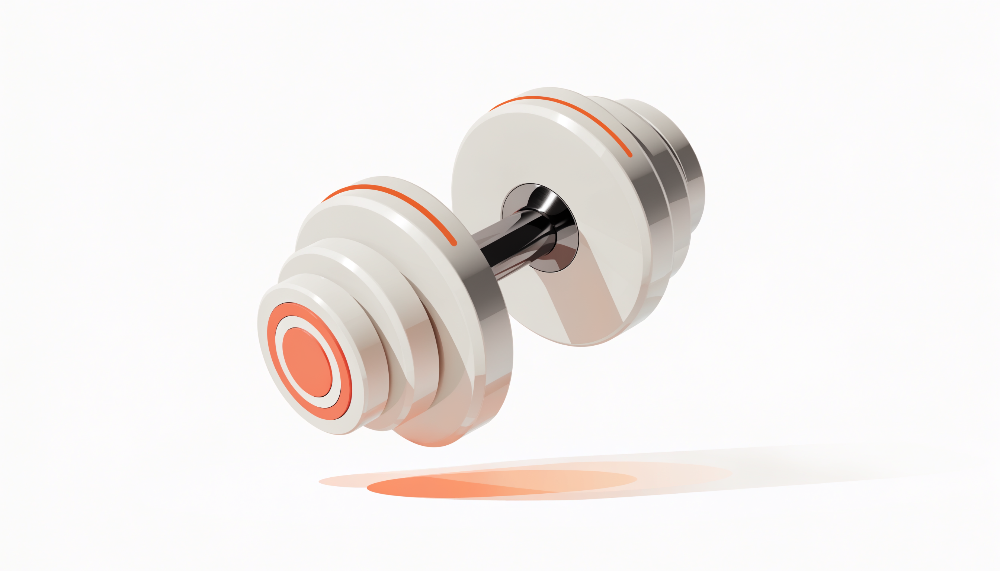

📌 3줄 요약
조절식 덤벨은 한 쌍으로 여러 무게를 쓰니 공간·비용을 아껴 홈트 입문에 딱이다.

고를 때 핵심은 조절 방식(다이얼이 가장 편함)·무게 범위·내구성(블럭 유격) 세 가지다.

입문 무게는 남성 한 손 6~9kg, 여성 3~6kg에서 시작해 익숙해지면 올리면 된다.

홈트 장비 중 활용도가 가장 높은 게 덤벨인데, 무게별로 여러 쌍을 사면 자리도 돈도 많이 들죠. 그래서 입문자에게는 **조절식 덤벨 추천**이 많아요. 한 쌍으로 가벼운 무게부터 무거운 무게까지 커버하니까요. 이 글에서는 조절식 덤벨을 방식·무게·내구성·가성비 기준으로 고르는 법을, 살 때 주의점까지 한 번에 정리해 드릴게요.

먼저 결론부터 말하면, **편의성은 다이얼 방식, 가성비는 조립식**이에요. 왜 그런지 아래에서 하나씩 풀어 드릴게요.

## 각개 덤벨 vs 조절식 덤벨

덤벨은 크게 무게가 고정된 각개 덤벨과, 한 쌍으로 무게를 바꾸는 조절식 덤벨로 나뉘어요. 둘의 장단점이 분명해요.

| 항목 | 각개(고정) 덤벨 | 조절식 덤벨 |
| --- | --- | --- |
| 공간 | 무게별로 쌓여 자리 많이 먹음 | 한 쌍이면 끝, 공간 절약 |
| 비용 | 무게 늘수록 계속 추가 구매 | 한 번 사면 범위 내 해결 |
| 안정성 | 튼튼·고장 없음 | 블럭 유격·이탈 가능성 |
| 추천 대상 | 헬스장·넓은 공간 | 홈트·원룸·입문자 |

정리하면 **공간이 좁고 입문이라면 조절식**, 무게를 자주 안 바꾸고 안정성만 본다면 각개예요. 대부분의 홈트 입문자에게는 조절식이 맞아요. 운동 장비를 처음 갖추는 분이라면 [홈트 기구 추천 글](/home-workout-beginner-gear/)도 함께 보시면 순서를 잡기 좋아요.

## 조절 방식 3가지 — 다이얼·핀/블럭·조립식

조절식 덤벨은 무게를 바꾸는 방식에 따라 사용감이 크게 달라져요. 크게 세 가지예요.

| 방식 | 조절법 | 장점 | 단점 |
| --- | --- | --- | --- |
| 다이얼 | 손잡이를 돌려 무게 선택 | 가장 빠르고 편함 | 가격대 높은 편, 떨어뜨리면 손상 |
| 핀/블럭 | 핀을 빼거나 잠금 블럭 탈착 | 견고·안정적 | 조절이 다이얼보다 번거로움 |
| 조립식 | 원판을 너트로 끼움 | 가장 저렴(가성비) | 무게 바꿀 때 손이 많이 감 |

운동 중 무게를 자주 바꾸는 분(서킷·슈퍼세트)은 **다이얼 방식**이 압도적으로 편해요. 무게를 거의 안 바꾸거나 예산이 빠듯하면 **조립식**이 가성비가 가장 좋고요. 핀/블럭 방식은 그 중간으로, 유격이 적고 튼튼한 편이라 안정성을 중시하면 좋아요.

## 내게 맞는 무게 고르는 법

조절식 덤벨 추천에서 가장 많이 묻는 게 "몇 kg을 사야 하냐"예요. 기준은 간단해요. **한 동작을 8~12회 했을 때 마지막에 힘든 무게**가 지금 내 무게예요.

입문 기준으로 한 손 무게는 **남성 6~9kg, 여성 3~6kg** 정도에서 시작하면 무난해요. 운동이 익숙해지면 0.5~1kg씩 천천히 올리면 되고요. 그래서 **최대 무게가 여유 있는 제품**(예: 한 손 20kg 이상까지 올라가는 것)을 고르면 몇 달 만에 가벼워져서 다시 살 일이 없어요.

무게 **조절 간격**도 봐야 해요. 2.5kg 단위로 듬성듬성 올라가는 것보다, 단계가 촘촘한(예: 15단계) 제품이 부위·운동별로 세밀하게 맞추기 좋아요.

## 고르는 체크리스트

제품을 비교할 때 아래 다섯 가지만 확인하면 실패가 줄어요.

- **무게 범위·간격** — 내 시작 무게부터 한참 위까지 커버하는지, 단계가 촘촘한지.
- **조절 메커니즘** — 빠르고 손 안 가게 바뀌는지(다이얼이 유리).
- **내구성·안정성** — 블럭이 운동 중 풀리거나 이탈하지 않는지, 유격(덜그럭거림)이 적은지.
- **재질** — PVC·크롬·고무·우레탄 등. 우레탄이 냄새 적고 고급이지만 비싸고, 미끄럼 방지 그립인지 확인.
- **각진 형태** — 바닥에 놓을 때 굴러가지 않게 다각형 형태면 편함.

여기에 **후기 수와 베스트셀러 여부**까지 보면 더 안전해요. 같은 방식이라도 후기 많고 평점 안정적인 제품이 유격·AS에서 실패가 적어요.

<a class="btn" href="https://www.coupang.com/np/categories/178155" target="_blank" rel="nofollow sponsored noopener">→ 쿠팡에서 조절식 덤벨 후기·가격 확인하기</a>

## 가성비 있게 사는 법

가격은 **조립식 < 핀/블럭 < 다이얼** 순으로 올라가는 게 보통이에요. 그래서 "편의성을 조금 포기하고 가성비"라면 원판 조립식이, "돈을 좀 더 쓰고 편하게"라면 다이얼이 답이에요.

재질로도 가격이 갈려요. PVC·고무 코팅이 저렴하고, **우레탄은 냄새가 적고 내구성이 좋지만 가장 비싸요**. 입문 단계에서는 굳이 최고가 우레탄을 갈 필요는 없고, 후기 좋은 중간 가격대면 충분해요. 가격·구성은 시즌에 따라 자주 바뀌니 단정하지 말고, 구매 직전 판매 페이지에서 현재가와 후기를 꼭 확인하세요.

## 살 때 주의점

- **유격·소음** — 저가 제품은 운동 중 블럭이 덜그럭거리고 소음이 나요. 후기에서 "유격·소음" 언급을 살피세요.
- **블럭 이탈** — 다이얼·블럭이 헐거우면 떨어질 수 있어요. 잠금이 확실한지 확인.
- **층간소음** — 떨어뜨리면 아랫집에 충격이 커요. 매트를 깔고 쓰는 걸 추천해요.
- **AS·부품** — 다이얼은 고장 시 수리가 까다로울 수 있어요. AS 되는 브랜드가 안전해요.

이 네 가지만 후기로 걸러내도 "사놓고 후회"를 크게 줄일 수 있어요.

## 자주 묻는 질문

**Q. 조절식 덤벨, 입문자는 몇 kg짜리를 사야 하나요?**
A. 한 손 기준 남성은 20kg대, 여성은 10kg대까지 올라가는 제품을 고르면 한동안 다시 살 일이 없어요. 시작 무게는 8~12회에 힘든 정도(남성 6~9kg, 여성 3~6kg)면 적당합니다.

**Q. 다이얼식과 조립식 중 뭐가 나아요?**
A. 무게를 자주 바꾸고 편함을 원하면 다이얼, 예산을 아끼고 무게를 자주 안 바꾸면 조립식이에요. 안정성을 중시하면 핀/블럭 방식도 좋습니다.

**Q. 조절식 덤벨은 안전한가요?**
A. 잠금이 확실하고 유격이 적은 제품이면 안전해요. 저가 제품은 블럭 이탈·유격 위험이 있으니 후기에서 안정성 평가를 꼭 확인하세요. 떨어뜨릴 때를 대비해 매트도 까는 게 좋아요.

**Q. 우레탄 덤벨이 꼭 필요한가요?**
A. 아니에요. 우레탄은 냄새가 적고 고급이지만 비싸요. 입문 단계에선 후기 좋은 PVC·고무 코팅 중간 가격대로 충분합니다.

**Q. 무게 조절 간격은 왜 중요한가요?**
A. 간격이 촘촘하면(예: 15단계) 부위·운동별로 무게를 세밀하게 맞출 수 있어요. 단계가 듬성듬성하면 딱 맞는 무게를 못 써서 운동 효율이 떨어집니다.

---

**관련 키워드** — #조절식덤벨추천 #무게조절덤벨 #덤벨추천 #홈트덤벨 #다이얼덤벨 #파워블럭 #가성비덤벨 #홈트레이닝 #덤벨무게 #홈짐 #운동기구추천 #덤벨고르는법
