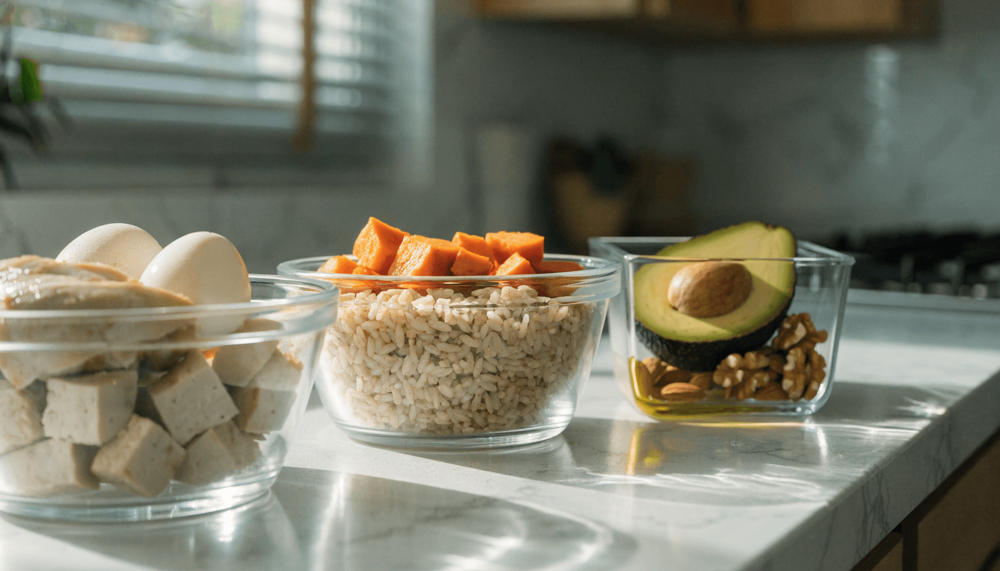

📌 3줄 요약
건강 기준(2025 한국인 영양소 섭취기준)은 탄수화물 50~65%, 단백질 10~20%, 지방 15~30%입니다.

체지방 감량이 목표라면 단백질 비중을 끌어올린 5:3:2 또는 4:4:2가 흔히 권장됩니다.

비율은 방향일 뿐, 결국 내 목표 칼로리를 정하고 그램 수로 바꿔야 식단으로 쓸 수 있습니다.

다이어트를 시작하면 가장 먼저 부딪히는 질문이 "탄단지 비율을 어떻게 맞춰야 하나"입니다. 다이어트 식단 탄단지 비율은 정답이 하나로 정해진 게 아니라, 건강 기준선을 토대로 본인 목표(감량·유지·증량)에 맞춰 조정하는 것입니다. 이 글에서는 공식 기준부터 목적별 황금비율, 그리고 내 칼로리에 맞춘 그램 수 계산법까지 순서대로 정리했습니다.

## 탄단지 비율이 다이어트에서 중요한 이유

탄단지는 탄수화물·단백질·지방, 즉 우리 몸이 에너지로 쓰는 3대 영양소를 말합니다. 같은 칼로리를 먹어도 이 세 가지를 어떤 비율로 채우느냐에 따라 포만감, 근육 유지, 체지방 감량 속도가 달라집니다.

특히 다이어트 중에는 단백질이 핵심입니다. 칼로리를 줄이면 몸은 지방뿐 아니라 근육까지 분해하려 하는데, 단백질을 충분히 먹으면 근육 손실을 막아 기초대사량을 지킬 수 있습니다. 근육이 빠지면 같은 양을 먹어도 살이 더 잘 찌는 몸이 되기 때문에, 감량기일수록 단백질 비중을 높이는 것입니다.

지방도 무조건 줄이면 안 됩니다. 호르몬 생성과 지용성 비타민 흡수에 필요하기 때문에, 너무 낮추면 컨디션과 대사가 함께 떨어집니다. 결국 탄단지 비율은 "무엇을 줄이고 무엇을 지킬지"를 정하는 설계도입니다.

## 공식 기준부터 — 2025 한국인 영양소 섭취기준

비율을 정하기 전에 건강한 기준선을 알아야 합니다. 가장 신뢰할 수 있는 기준은 [보건복지부 — 2025 한국인 영양소 섭취기준](https://www.mohw.go.kr/board.es?mid=a10503010100&bid=0027&act=view&list_no=1488441)입니다. 2025년 12월에 5년 만에 개정된 최신 기준으로, 에너지 적정비율을 다음과 같이 제시합니다.

| 영양소 | 2020년 기준 | 2025년 기준(현행) |
| --- | --- | --- |
| 탄수화물 | 55~65% | 50~65% |
| 단백질 | 7~20% | 10~20% |
| 지방 | 15~30% | 15~30% |

핵심 변화는 탄수화물 하한이 55%에서 50%로 내려가고, 단백질 하한이 7%에서 10%로 올라간 점입니다. 탄수화물 과잉이 만성질환·사망 위험과 관련된다는 연구가 반영된 결과입니다. 즉 공식 기준조차 "탄수는 조금 줄이고 단백질은 더 챙기라"는 방향으로 움직인 셈입니다. 다이어트 식단은 이 범위를 출발점으로 삼으면 됩니다.

## 목적별 탄단지 비율 — 감량·유지·증량

같은 다이어트라도 목표에 따라 비율이 달라집니다. 아래는 일반적으로 권장되는 목적별 비율입니다(개인차가 있으니 절대값이 아니라 출발점으로 보세요).

| 목표 | 탄수화물 | 단백질 | 지방 | 한 줄 설명 |
| --- | --- | --- | --- | --- |
| 완만한 감량·유지 | 50% | 30% | 20% | 무리 없이 오래 유지하기 좋은 균형형 |
| 적극적 체지방 감량 | 40% | 40% | 20% | 단백질을 끌어올려 근손실 최소화 |
| 근육 증량(린매스업) | 50% | 30% | 20% | 비율은 비슷하되 칼로리를 잉여로 |

흔히 말하는 **5:3:2**(탄50·단30·지20)는 완만한 감량과 유지에 두루 쓰기 좋은 기본값입니다. 좀 더 공격적으로 체지방을 빼고 싶다면 단백질을 30%에서 40%로 올린 **4:4:2**가 자주 추천됩니다.

## 내 탄단지 그램 수 계산하는 법

비율(%)은 식단으로 바로 쓸 수 없습니다. 결국 "탄수 몇 g, 단백질 몇 g"으로 바꿔야 장을 보고 끼니를 짤 수 있습니다. 4단계로 계산합니다.

1. **목표 칼로리를 정합니다.** 감량기라면 유지 칼로리에서 약 15~20%를 뺍니다. 예를 들어 유지가 1,800kcal면 감량 목표는 약 1,500kcal입니다.
2. **비율을 곱해 영양소별 칼로리를 구합니다.** 4:4:2로 잡으면 탄수 600kcal, 단백질 600kcal, 지방 300kcal입니다.
3. **그램으로 환산합니다.** 탄수화물과 단백질은 1g당 4kcal, 지방은 1g당 9kcal입니다.
4. **끼니로 나눕니다.** 하루 총량을 3끼로 나누면 끼니별 목표가 나옵니다.

위 예시(1,500kcal·4:4:2)를 환산하면 탄수화물 약 150g, 단백질 약 150g, 지방 약 33g이 됩니다.

💡 단백질은 체중으로 한 번 더 점검
다이어트·운동을 병행한다면 단백질은 체중 1kg당 1.2~2.0g이 권장됩니다. 70kg이라면 약 84~140g입니다. 비율로 계산한 값이 이 범위 안에 들어오는지 교차 확인하면 안전합니다.

## 같은 비율이라도 '질'이 다르다

탄단지 비율을 똑같이 맞춰도 어떤 음식으로 채우느냐에 따라 결과가 갈립니다. 비율만큼 음식의 질이 중요합니다.

- **탄수화물** — 흰쌀밥·빵·설탕 대신 현미, 귀리, 고구마, 통밀, 콩류 같은 저GI 식품을 고릅니다. 같은 양이라도 혈당을 천천히 올려 포만감이 오래갑니다.
- **단백질** — 닭가슴살, 계란, 흰살·등푸른 생선, 두부, 그릭요거트가 대표적입니다. 끼니마다 손바닥 크기 정도씩 나눠 먹는 게 흡수에 유리합니다.
- **지방** — 아보카도, 견과류, 올리브유, 등푸른 생선의 지방을 택합니다. 튀김·가공육의 포화지방·트랜스지방은 줄입니다.

여기에 채소로 식이섬유를 하루 20~25g 채우면 포만감과 장 건강을 함께 잡을 수 있습니다. 식이섬유는 칼로리는 거의 없으면서 배를 든든하게 해 과식을 막아줍니다.

## 다이어트 식단에 적용한 하루 예시

1,500kcal·4:4:2 기준으로 짠 하루 예시입니다. 그대로 따라 하기보다 본인 계산값에 맞춰 양을 조절하세요.

- **아침** — 귀리 50g + 그릭요거트 + 블루베리, 삶은 계란 2개
- **점심** — 현미밥 2/3공기, 닭가슴살 150g, 나물·샐러드 듬뿍, 올리브유 한 스푼
- **저녁** — 고구마 1개, 구운 흰살생선 또는 두부, 데친 채소
- **간식** — 견과류 한 줌 또는 단백질 보충제 1스쿱

식단만으로 감량 속도가 더디다면 운동을 병행하는 게 좋습니다. 집에서 시작한다면 [홈트 기구 추천 — 입문자가 처음 살 장비](/home-workout-beginner-gear/)를 참고해 가벼운 근력 운동부터 더해보세요.

## 탄단지 비율 맞출 때 흔한 실수

⚠️ 이건 피하세요
지방을 0에 가깝게 줄이거나, 탄수화물을 극단적으로 끊는 식단은 단기 감량엔 보여도 오래 못 갑니다. 요요와 컨디션 저하로 돌아오기 쉽습니다.

가장 흔한 실수는 **단백질 부족**입니다. 비율로는 맞춰도 절대량이 체중당 1.2g에 못 미치면 근육이 빠집니다. 두 번째는 **숨은 지방**입니다. 샐러드 드레싱, 볶음 기름, 소스에 든 지방이 의외로 커서 "건강하게 먹었는데 살이 안 빠지는" 원인이 됩니다.

세 번째는 **비율에만 집착하는 것**입니다. 탄단지 비율이 완벽해도 총 칼로리가 유지 칼로리를 넘으면 체지방은 줄지 않습니다. 비율은 칼로리 적자라는 큰 틀 안에서 의미가 있습니다. 먼저 칼로리, 그다음 비율, 마지막으로 음식의 질 순서로 챙기는 게 현실적입니다.

## 자주 묻는 질문 (FAQ)

**Q. 다이어트 탄단지 비율로 5:3:2와 4:4:2 중 뭐가 더 좋나요?**
A. 완만하게 오래 유지하려면 5:3:2, 단기간 체지방을 적극적으로 빼려면 단백질을 높인 4:4:2가 유리합니다. 운동 강도가 높을수록 4:4:2 쪽이 근손실 방지에 좋습니다.

**Q. 탄수화물을 아예 끊으면 더 빨리 빠지지 않나요?**
A. 초반 체중은 빠르게 줄지만 대부분 수분이고, 장기적으로는 컨디션 저하와 요요 위험이 큽니다. 극단적 제한보다 저GI 탄수화물로 양과 질을 조절하는 편이 지속 가능합니다.

**Q. 단백질은 하루에 얼마나 먹어야 하나요?**
A. 다이어트와 운동을 병행한다면 체중 1kg당 1.2~2.0g이 권장됩니다. 체중 70kg 기준 약 84~140g이며, 끼니마다 나눠 먹는 게 흡수에 유리합니다.

**Q. 탄단지 비율만 맞추면 살이 빠지나요?**
A. 아닙니다. 총 칼로리가 소비보다 많으면 비율이 완벽해도 체지방은 줄지 않습니다. 칼로리 적자를 먼저 만든 뒤 비율로 영양 균형을 잡는 순서가 맞습니다.

**Q. 지방은 다이어트의 적 아닌가요?**
A. 적정량의 좋은 지방은 호르몬과 비타민 흡수에 필요합니다. 총 칼로리의 15~20%는 아보카도·견과류·올리브유 같은 건강한 지방으로 꼭 채우는 게 좋습니다.

---

**관련 키워드** — #다이어트식단탄단지비율 #탄단지비율 #탄단지비율계산 #다이어트탄단지 #5대3대2비율 #단백질섭취량 #체지방감량식단 #저탄고단백 #탄수화물섭취량 #다이어트식단표 #한국인영양소섭취기준 #다이어트칼로리계산
