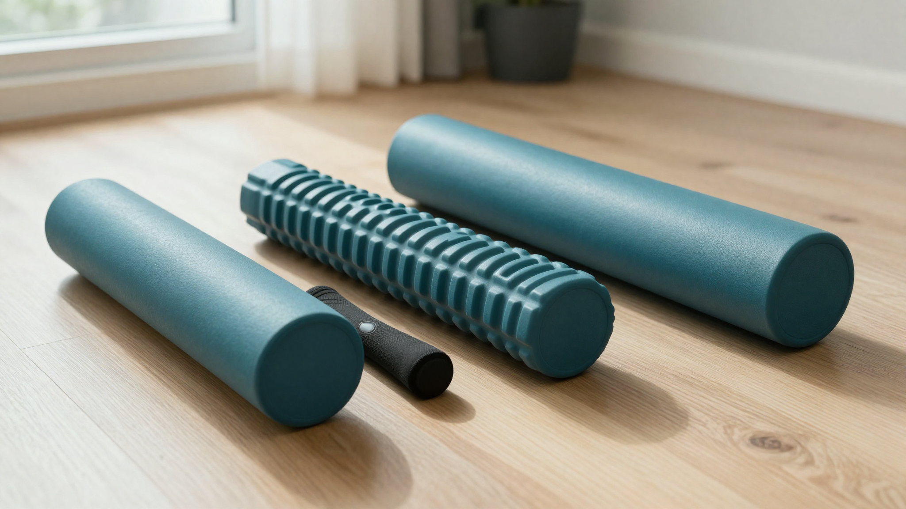

폼롤러 추천 순위를 검색하면 제품 이름만 1위부터 쭉 나열돼 있어서, 정작 "나한테 뭐가 1순위인지"는 안 나오죠. 저도 처음 찾아봤을 때 순위표마다 제품이 다 달라서 뭘 믿어야 할지 한참 헤맸어요. 결론부터 말하면요, **폼롤러는 목적에 따라 1순위가 바뀌는 물건**입니다. 그래서 이 글은 특정 브랜드 줄세우기 대신, 입문·휴대·지압·전신·회복이라는 용도별로 어떤 종류가 1순위인지 스펙과 후기를 뒤져 순위로 정리했습니다.

📌 3줄 요약
대부분의 사람에게 종합 1순위는 <b>EVA 민무늬 미디엄 강도, 90cm(또는 45cm)</b> 폼롤러입니다. 활용도가 가장 높고 실패가 적어요.

휴대·부위 집중이면 짧은 30~45cm, 강한 지압이면 돌기형 EPP, 회복 중심이면 진동 폼롤러가 용도별 1순위입니다.

가격은 시기·구성에 따라 자주 바뀌니 대략 가격대로만 참고하고, 구매 페이지에서 확인하세요.

## 폼롤러 추천 순위, 어떤 기준으로 정했나요?

먼저 밝히면, 이 순위는 제가 제품을 일일이 써보고 매긴 실측 등급이 아닙니다. 여러 판매처 스펙과 사용자 후기, 그리고 물리치료·피트니스 가이드가 공통으로 권하는 기준을 종합해 **용도별로 어떤 종류가 무난한 1순위인지**를 정리한 것이에요. 여기서 많이들 헷갈리는데, 폼롤러는 "제일 비싼 게 1위"가 아니라 "내 목적에 맞는 게 1위"입니다.

순위를 가른 축은 소재·표면·강도·길이 네 가지입니다. 이 축을 하나하나 뜯어보는 건 [폼롤러 고르는 법](/foam-roller-recommend/)에 이미 자세히 정리해 뒀으니 여기서 반복하지 않고, 이 글에서는 딱 하나만 기억하고 넘어가면 됩니다. **소재는 EVA(부드러움) → EPP(단단) → 코르크(더 강함) 순으로 세지고, 입문일수록 부드러운 쪽이 안전하다.** 이제 이걸 바탕으로 "어떤 상황엔 뭐가 1순위인지"를 바로 뽑아드릴게요.

## 처음 하나만 산다면 뭐가 1순위인가요?

**대부분의 사람에게 종합 1순위는 EVA 소재의 민무늬 미디엄 강도 90cm 폼롤러입니다.** 국내외 가이드가 입문용으로 가장 자주 권하는 조합이에요.

이유는 실패 확률이 낮아서입니다. 미디엄 강도는 압력 부족과 과한 통증 사이에서 균형을 잡아주고, 민무늬 표면은 넓게 눌러 이완해 초보에게 부담이 적습니다. 저도 처음엔 돌기가 무조건 좋은 줄 알았는데, 초보에겐 자극이 세거나 피부에 부담이 될 수 있더라고요.

이 조합이 실제로 빛나는 상황을 그려보면 이렇습니다. 자기 전 바닥에 등을 대고 90cm 롤러를 세로로 받쳐 굽은 흉추를 펴는 스트레칭, 운동 후 허벅지 앞·옆을 길게 훑는 이완처럼 **한 개로 전신을 두루 커버하는 하루 루틴**에 잘 맞아요. 이럴 때 90cm의 안정감이 45cm보다 확실히 편합니다. 보관 공간이 정 부족할 때만 45cm로 내리는 걸 권합니다.

## 2순위 — 휴대·부위 집중용 짧은 폼롤러

**들고 다니거나 종아리·발바닥 같은 특정 부위만 집중해서 풀 거라면 30~45cm 짧은 폼롤러가 1순위입니다.** 가방에 들어가는 크기가 핵심 장점이에요.

짧은 폼롤러는 안정적으로 전신을 받치는 데는 불리하지만, 좁은 부위를 정확히 누르는 데는 오히려 편합니다. 예를 들어 사무실 의자 밑에 30cm 하나를 두고 오후에 종아리만 5분 굴리는 식의 짧은 루틴에 딱이에요. 허벅지 옆, 발바닥처럼 국소 부위를 집중해서 풀 때도 짧은 쪽이 다루기 쉽습니다. 여행이나 출장이 잦은 분에게도 이 크기가 실용적입니다.

다만 이건 "두 번째 폼롤러"로 더 어울립니다. 집에 90cm 하나가 있고, 휴대용으로 하나 더 두는 식이죠. 처음 딱 하나만 산다면 활용도 넓은 긴 쪽이 후회가 적습니다.

## 3순위 — 강한 지압을 원하면 돌기형 EPP

**폼롤러를 좀 써봐서 미디엄으로는 시원함이 부족하다면 돌기형(그리드) EPP가 1순위입니다.** 오돌토돌한 돌기가 특정 지점을 깊게 자극해줍니다.

돌기형은 마치 손가락으로 지압하듯 특정 근육 지점을 파고드는 느낌을 줍니다. 소재도 단단한 EPP나 그보다 강한 코르크로 가면 자극이 더 세져요. 뭉침이 심하거나 깊은 이완을 원하는 숙련자에게 맞는 조합입니다.

⚠️ 강도 올릴 때 주의
입문자가 처음부터 단단한 돌기형을 쓰면 통증이나 멍으로 이어질 수 있습니다. 미디엄 민무늬에 충분히 익숙해진 뒤 단계적으로 올리세요.

허리·관절처럼 직접 굴리면 안 되는 부위가 있으니, 부위별 주의사항은 고르는 법 글에서 확인하고 무리하지 마세요.

## 4순위 — 전신 홈트 병행이면 긴 원형 폼롤러

**마사지뿐 아니라 스트레칭·코어 운동까지 폼롤러로 같이 하고 싶다면 90cm 긴 원형이 1순위입니다.** 운동 병행 활용도가 가장 넓어요.

긴 원형 폼롤러는 등에 세로로 대고 누워 가슴을 여는 스트레칭, 균형 잡기 코어 운동 등에 두루 쓰입니다. 반원형은 낮은 단계 운동이나 지압에 어울리지만, 하나로 여러 용도를 커버하려면 원형이 유리합니다. 홈트 초보에게 "운동도 되고 마사지도 되는" 가성비 도구로 자주 추천되는 이유입니다.

사실 이 4순위는 종합 1순위와 겹칩니다. 입문 만능 조합이 곧 전신 홈트에도 좋은 선택이라는 뜻이에요. 그만큼 긴 EVA 원형 하나의 활용 범위가 넓습니다.

## 5순위 — 회복 중심이면 진동(전동) 폼롤러

**운동 후 회복이나 워밍업에 무게를 둔다면 진동 폼롤러가 1순위 후보입니다.** 진동이 더해져 자극이 커지는 방식이에요.

진동 폼롤러는 일반 폼롤러에 모터 진동을 더한 형태로, 여러 단계의 진동으로 근육을 자극합니다. 다만 가격이 일반 폼롤러보다 훨씬 높고(대체로 수만 원에서 십만 원대), 충전·소음 같은 관리 요소도 생깁니다. 그래서 입문 첫 구매로는 권하지 않고, 일반 폼롤러를 충분히 쓴 뒤 회복 루틴을 강화하고 싶을 때 고려하는 게 좋습니다.

굳이 진동까지 필요 없다면, 3순위의 돌기형으로도 강한 자극은 충분히 얻을 수 있어요. 진동은 "있으면 좋은" 상위 옵션이지 필수는 아닙니다.

## 용도별 폼롤러 추천 순위 한눈에

지금까지의 용도별 1순위를 표로 묶어봤습니다. 가격은 정가·시기·구성에 따라 달라지니 대략적인 감으로만 참고하세요.

| 용도 | 1순위 종류 | 소재·표면 | 대략 가격대 |
|---|---|---|---|
| 입문 만능(종합 1위) | 90cm 긴 원형 | EVA · 민무늬 · 미디엄 | 1~2만 원대 |
| 휴대·부위 집중 | 30~45cm 짧은 원형 | EVA · 민무늬 | 1만 원 안팎 |
| 강한 지압 | 돌기형(그리드) | EPP·코르크 · 돌기 | 1~3만 원대 |
| 전신 홈트 병행 | 90cm 긴 원형 | EVA · 민무늬 | 1~2만 원대 |
| 회복·워밍업 | 진동 폼롤러 | 전동 | 수만~십만 원대 |

💡 색으로 강도 눈치채기
같은 모양이라도 색이 강도 힌트가 되는 경우가 있어요. 흰색 계열이 가장 부드럽고 검은색이 단단한 편, 파랑·빨강은 중간 강도로 파는 제품이 많습니다.

절대 규칙은 아니니 상세페이지의 밀도·강도 표기를 함께 확인하세요.

## 살 때 실수하지 않는 법

첫 구매에서 가장 흔한 실수는 **자극이 셀수록 좋다고 생각해 처음부터 단단한 돌기형을 사는 것**입니다. 저도 비싸고 센 걸 사야 효과가 클 줄 알았는데, 입문 단계에선 오히려 통증 때문에 안 쓰게 되기 쉬워요. 미디엄 민무늬로 시작해 자극이 부족해질 때 올리는 편이 실패가 적습니다.

저가 제품은 냄새나 마감 문제가 후기에 종종 보이니, 구매 전 리뷰에서 냄새·변형·입자 벗겨짐 언급을 한 번 확인하는 게 좋습니다. EVA는 오래 쓰면 눌려 변형될 수 있고, EPP는 표면 입자가 떨어질 수 있다는 점도 감안하세요.

마사지 도구를 폼롤러 하나로 끝낼지, 손이 닿기 어려운 부위용으로 다른 도구를 더할지 고민된다면 [마사지건 추천](/massage-gun-recommend/)도 함께 참고하면 도움이 됩니다. 다양한 홈트레이닝 용품을 한눈에 보고 싶다면 [쿠팡 홈트레이닝 용품](https://www.coupang.com/np/categories/178155) 카테고리에서 종류와 가격대를 비교해볼 수 있어요.

## 자주 묻는 질문 (FAQ)

**Q. 폼롤러 처음 산다면 순위 1위로 뭘 골라야 하나요?**
A. 대부분에게 종합 1순위는 EVA 민무늬 미디엄 강도의 90cm(또는 45cm) 폼롤러입니다. 활용도가 넓고 통증 없이 적응하기 좋아 실패 확률이 가장 낮습니다.

**Q. 돌기형이 민무늬보다 무조건 좋은 순위인가요?**
A. 아닙니다. 돌기형은 강한 지압을 원하는 숙련자에게 1순위일 뿐, 입문자에게는 자극이 과할 수 있습니다. 처음에는 민무늬로 시작해 익숙해진 뒤 돌기형으로 올리는 순서를 권합니다.

**Q. 진동 폼롤러는 꼭 사야 하나요?**
A. 필수는 아닙니다. 회복·워밍업에 무게를 둔 상위 옵션이라 가격이 높고 관리 요소도 있습니다. 일반 폼롤러를 충분히 쓴 뒤 필요하다고 느낄 때 고려하면 됩니다.

**Q. 폼롤러 가격은 대략 얼마인가요?**
A. 일반 EVA·EPP 폼롤러는 대체로 1~3만 원대, 진동 폼롤러는 수만 원에서 십만 원대까지 다양합니다. 다만 가격은 시기·구성에 따라 자주 바뀌니 구매 페이지에서 현재 가격을 확인하세요.

이거 하나만 기억하면 돼요. 폼롤러 추천 순위의 정답은 가장 비싼 것이 아니라 **내 목적에 맞는 1순위**입니다. 처음이라면 EVA 민무늬 미디엄 90cm부터 시작해, 부족할 때 용도에 맞춰 돌기형이나 진동으로 넓혀 가면 됩니다.

---

**관련 키워드** — #폼롤러추천순위 #폼롤러추천 #입문폼롤러 #폼롤러종류 #돌기폼롤러 #진동폼롤러 #EVA폼롤러 #EPP폼롤러 #폼롤러길이 #폼롤러강도 #홈트레이닝용품 #근막이완
