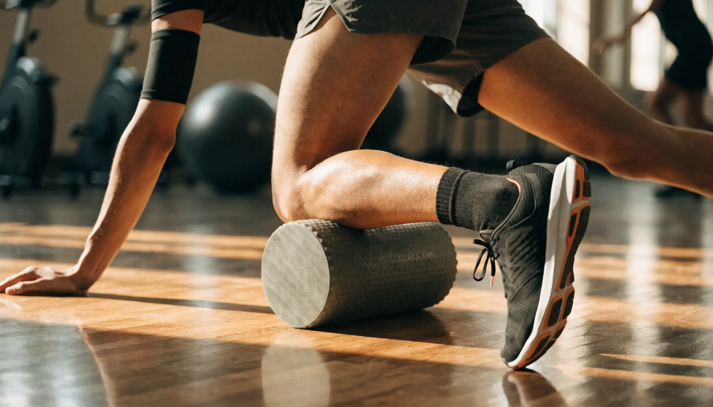

폼롤러 사려고 검색하면 EVA·EPP에 민무늬·돌기, 90cm·30cm까지 죄다 헷갈리죠. 저도 처음 찾아봤을 때 소재는 알파벳이고 표면은 종류별로 달라서 뭘 골라야 할지 한참 헤맸어요. 결론부터 말하면요, **입문자는 부드러운 EVA 민무늬 폼롤러 하나면 충분**하고, 자극이 부족해질 때 단계적으로 올리면 됩니다. 이 글에서는 폼롤러 추천 기준을 강도·표면·길이·진동 여부로 나누고, 입문자가 어디까지 사야 하는지와 절대 하면 안 되는 부위까지 스펙과 후기를 뒤져 한 번에 정리해 드릴게요.

📌 3줄 요약
폼롤러는 비싼 진동부터 살 게 아니라, 소재·표면·길이를 목적에 맞춰 고르는 물건입니다.

입문은 <b>부드러운 EVA · 민무늬 · 90cm(또는 45cm)</b> 하나면 충분하고, 자극이 부족해지면 EPP·돌기·진동으로 단계 상향하면 됩니다.

단, 허리·IT밴드·관절은 직접 굴리면 안 되는 부위라 이건 꼭 알고 시작하세요.

## 폼롤러, 뭘 먼저 봐야 하나요?

고르기 전에 네 가지만 정하면 선택이 훨씬 쉬워집니다. 강도(밀도), 표면, 길이, 그리고 진동 여부입니다. 여기서 많이들 헷갈리는데, 비싼 진동 폼롤러부터 사는 게 아니라 이 네 축을 내 상황에 맞추는 게 먼저예요.

**강도는 밀도로 갈립니다.** 밀도가 높을수록 압력이 강하고 깊은 근육까지 자극하고, 낮을수록 부드럽습니다. 입문자나 자극에 예민한 분은 저밀도, 어느 정도 익숙하면 고밀도로 갑니다.

**표면은 민무늬냐 돌기냐입니다.** 이게 생각보다 중요한데, 아래에서 따로 짚을게요.

**길이는 목적으로 정합니다.** 전신을 다 쓸지, 종아리만 짧게 풀지에 따라 90cm와 30~45cm로 갈립니다.

## 소재와 표면으로 고르기 — EVA·EPP, 민무늬·돌기

소재부터요. 흔한 두 가지는 EVA와 EPP입니다. **EVA**는 상대적으로 부드럽고 저렴한 대신 오래 쓰면 눌려 변형이 오기 쉽고, **EPP**는 단단하고 내구성이 좋은 대신 표면 입자가 떨어지기도 합니다. 그래서 처음엔 부담 적은 EVA로 시작해, 자극이 약하게 느껴지면 단단한 EPP로 넘어가는 흐름이 무난해요.

표면은 두 갈래입니다. **민무늬(스무스)** 는 표면이 매끈해 근막을 넓게 눌러 이완하는 데 유리하고, **돌기형(그리드·지압)** 은 오돌토돌한 돌기가 특정 지점을 강하게 자극해 시원한 느낌이 큽니다. 저도 처음엔 돌기가 무조건 좋은 줄 알았는데, 찾아보니 입문자에겐 자극이 너무 셀 수 있어서 **민무늬로 시작하는 걸 권하는 자료가 많았어요**. 시원한 지압감을 원하면 그때 돌기로 넘어가면 됩니다.

## 길이는 목적으로 고른다 — 90 · 60 · 30~45cm

길이는 취향이 아니라 목적으로 정하면 실패가 없습니다. 스펙을 비교해 표로 묶어봤어요.

| 길이 | 잘 맞는 용도 | 이런 분께 |
| --- | --- | --- |
| 90cm | 전신·척추 라인·서서 하는 운동까지 범용 | 홈트에서 두루 쓸 한 개를 살 입문자 |
| 60cm | 등·엉덩이·허리 등 중간 부위 | 수납·활용 균형을 원하는 분 |
| 30~45cm | 종아리·옆구리 등 좁은 부위, 휴대 | 헬스장·출장에 들고 다닐 분 |

지름은 보통 약 15cm가 표준이라 크게 고민하지 않아도 됩니다. **집에서 두루 쓸 한 개**라면 90cm가 가장 활용도가 높고, 종아리 집중이나 휴대가 목적이면 짧은 쪽이 낫습니다.

## 입문자 강도 로드맵 — 어디까지 사야 할까

폼롤러에서 가장 헷갈리는 게 "얼마나 센 걸 사야 하나"인데, 처음부터 센 걸 사면 아파서 안 쓰게 됩니다. 그래서 제가 단계별 로드맵으로 정리해봤어요.

| 단계 | 추천 | 넘어갈 신호 |
| --- | --- | --- |
| 1단계 · 입문 | 부드러운 EVA · 민무늬 · 90cm | 굴려도 자극이 밋밋하게 느껴질 때 |
| 2단계 · 적응 | 단단한 EPP 또는 돌기형 | 특정 뭉친 지점을 더 강하게 풀고 싶을 때 |
| 3단계 · 심화 | 진동(전동) 폼롤러 | 회복 속도를 더 챙기고 싶고 예산 여유가 있을 때 |

💡 이거 하나만 기억하면
처음이라면 고민 없이 <b>부드러운 EVA 민무늬 90cm</b>로 시작하세요. 대부분은 여기서 충분하고, 부족함이 느껴질 때 2·3단계로 올리면 돈 낭비가 없습니다. 비싼 진동부터 사면 두 달 뒤 구석에서 먼지 쌓이기 쉬워요.

## 진동 폼롤러, 꼭 필요할까

진동 폼롤러는 모터로 떨림을 더해 자극을 키운 제품입니다. 자료를 찾아보니 연구에 따라 진동형이 일반형보다 근육 회복에 조금 더 유리하다는 결과도 있어, 운동 강도가 높거나 회복을 적극적으로 챙기려는 분에겐 값을 합니다. 다만 가격이 확 올라가고 무게도 있어서, **입문자에겐 대체로 과투자**예요. 일반 폼롤러로 습관을 먼저 들이고, 정말 필요할 때 넘어가도 늦지 않습니다.

## 부위별 사용법과 시간

입문은 하체부터가 안전합니다. 종아리와 허벅지 앞쪽(대퇴사두)처럼 큰 근육부터 시작해, 익숙해지면 햄스트링·둔근·등(광배근)으로 넓혀갑니다. 속도는 빠르게 왕복하지 말고, 한 지점을 30초에서 1분 정도 천천히 눌러주며 호흡을 함께 하는 게 요령이에요.

타이밍도 나눠 쓰면 좋습니다. 운동 전에는 짧게 굴려 가동 범위를 넓히고, 운동 후에는 천천히 풀어 뭉침과 뻐근함을 줄이는 식입니다. 처음엔 아플 수 있는데, 통증이 너무 심하면 매트 위에서 체중을 덜 실어 강도를 조절하세요.

## 이것만은 주의 — 하면 안 되는 부위

제품 고르는 것만큼 중요한 게 안전입니다. 순위글은 대개 이 부분을 빼먹는데, 잘못 쓰면 오히려 다칠 수 있어요.

⚠️ 직접 굴리면 안 되는 3부위
① <b>허리(요추)</b> — 척추를 직접 누르면 위험합니다. 허리는 폼롤러로 직접 굴리지 마세요. ② <b>IT밴드(허벅지 바깥)</b> — 통증만 크고 효과는 논란이라 강하게 미는 건 권하지 않습니다. ③ <b>관절·뼈·무릎 뒤·겨드랑이</b> — 뼈와 혈관·신경이 지나는 곳은 피합니다. 이 부위들은 근육이 아니라 구조물이라 직접 압박 대상이 아니에요.

또한 골다공증·골절이 있거나 항응고제를 복용 중이라면 멍·손상 위험이 있으니 무리하지 않는 게 좋습니다. 특정 부위 통증이 계속되면 사용을 멈추는 게 맞고요. 폼롤러는 근육을 부드럽게 풀어주는 도구이지 통증 치료 기구가 아니라는 점만 기억하면 됩니다.

## 한눈에 정리 — 유형별 추천

| 유형 | 특징 | 추천 대상 | 가격대(대략) |
| --- | --- | --- | --- |
| EVA 민무늬 | 부드럽고 무난 | 입문 1순위 | 1만 원대~ |
| EPP·돌기형 | 단단·강한 지압 | 적응 후 강자극 | 1만~2만 원대 |
| 진동(전동) | 회복 특화·고자극 | 중상급·회복 중시 | 3만 원대~ |

가격은 판매처·시기에 따라 다르니 참고 수준으로 보세요. 실제 판매 제품과 최신 가격은 [쿠팡 폼롤러](https://www.coupang.com/np/search?q=폼롤러)에서 확인하는 게 정확합니다.

## 자주 묻는 질문 (FAQ)

**Q. 폼롤러 입문자는 어떤 걸 사야 하나요?**
A. 부드러운 EVA 소재의 민무늬 90cm 제품이 가장 무난합니다. 자극이 세지 않아 오래 쓰기 좋고, 전신에 두루 활용됩니다. 부족함이 느껴지면 그때 단단한 EPP나 돌기형으로 넘어가세요.

**Q. 민무늬랑 돌기 폼롤러 중 뭐가 나은가요?**
A. 넓게 이완하는 데는 민무늬, 특정 지점을 강하게 지압하는 데는 돌기형이 유리합니다. 입문자는 자극이 과하지 않은 민무늬로 시작하는 걸 권하는 자료가 많고, 시원한 지압감을 원하면 돌기형으로 넘어가면 됩니다.

**Q. 진동 폼롤러 꼭 필요한가요?**
A. 필수는 아닙니다. 연구에 따라 회복에 조금 더 유리하다는 결과도 있지만 가격이 크게 올라가, 입문자에겐 대체로 과투자입니다. 일반 폼롤러로 습관을 들인 뒤 필요할 때 사도 늦지 않습니다.

**Q. 폼롤러는 하루에 얼마나 하면 되나요?**
A. 한 부위당 30초에서 1분 정도, 천천히 눌러주며 호흡을 함께 하는 게 좋습니다. 빠르게 왕복하기보다 뭉친 지점에 머무르듯 쓰고, 통증이 심하면 체중을 덜 실어 강도를 낮추세요.

**Q. 허리가 아픈데 폼롤러로 풀어도 되나요?**
A. 허리(요추)는 척추를 직접 누르게 돼 폼롤러로 직접 굴리는 걸 권하지 않습니다. 대신 등 위쪽(흉추)이나 엉덩이 근육을 풀면 간접적으로 도움이 될 수 있고, 통증이 지속되면 무리하지 말고 사용을 멈추는 게 안전합니다.

자, 이거 하나만 기억하면 돼요. 폼롤러는 비싼 진동부터가 아니라 **부드러운 EVA 민무늬 90cm 하나로 시작**해, 부족할 때 단계적으로 올리는 게 정답입니다. 허리·IT밴드·관절만 피하면 크게 위험할 일도 없고요. 홈트 장비를 처음 갖추는 중이라면 [홈트 입문 장비](/home-workout-beginner-gear/) 글도 함께 보시면 순서 잡기가 쉬워집니다.

#폼롤러추천 #폼롤러종류 #입문폼롤러 #EVA폼롤러 #EPP폼롤러 #진동폼롤러 #폼롤러사용법 #폼롤러길이 #폼롤러주의사항 #홈트장비 #근막이완 #폼롤러가격
