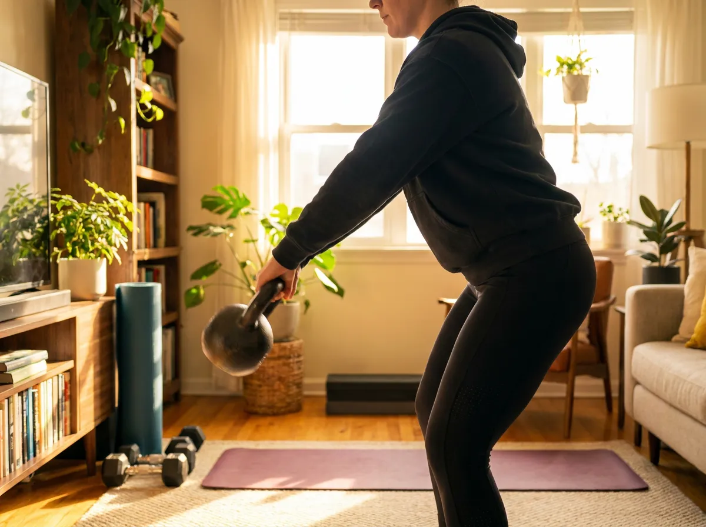

**가정용 케틀벨 추천** 글을 찾아보면 이상하게 무게 기준이 글마다 달라요. 어떤 글은 남자 16kg으로 시작하라 하고, 어떤 글은 8kg도 무겁다고 하죠. 저도 처음 스펙을 비교할 때 이 지점에서 한참 헤맸는데, 파고들어 보니 이유가 있었습니다. 국내 통설과 해외 기관 권장치가 실제로 다르더라고요. 결론부터 말하면요, 케틀벨은 **무게 → 종류 → 코팅·핸들** 순서로 세 번만 거르면 실패 없이 고를 수 있습니다. 이 글에서 그 기준을 표로 전부 정리해 드릴게요.

📌 3줄 요약
시작 무게는 <b>여성 8kg 안팎, 남성 12kg 안팎</b>이 국내 통설이고, 미국 운동협의회(ACE)는 이보다 가벼운 무게를 권합니다 — 웨이트 경험 없으면 낮은 쪽을 고르세요.

종류는 <b>주철(무쇠)</b>이 기본값, 대회 규격의 <b>경쟁용</b>은 한 손 동작 위주일 때, <b>조절식</b>은 공간이 좁을 때 답입니다.

국내 기준 입문용 주철 케틀벨은 <b>3만~8만 원 사이</b>(2026년 7월 시세 감각, 무게·브랜드 따라 다름)면 충분히 좋은 걸 삽니다.

## 케틀벨 무게, 국내 통설과 해외 기준이 다릅니다

여기서 많이들 헷갈리는데, 무게 추천이 글마다 다른 건 기준 자체가 두 갈래라서예요. 제가 국내 상위 글들과 해외 기관 자료를 나란히 놓고 비교해보니 이렇게 갈렸습니다.

| 기준 | 여성 시작 무게 | 남성 시작 무게 |
| --- | --- | --- |
| 국내 통설(상위 글 다수) | 8~12kg | 12~16kg |
| 미국 운동협의회 ACE | 4~7kg | 7~11kg |

차이가 꽤 크죠. 국내 통설은 스윙처럼 하체·엉덩이로 미는 양손 동작을 전제로 하고, ACE는 웨이트 경험이 전혀 없는 완전 입문자를 전제로 하기 때문입니다. 그래서 제 결론은 이렇습니다. 스쿼트·데드리프트를 해본 적 있으면 **국내 통설 기준**(여 8, 남 12), 웨이트가 처음이면 **한 단계 아래**(여 6, 남 8~10)에서 시작하는 게 안전해요. 케틀벨은 덤벨과 달리 무게중심이 손 밖에 있어서, 같은 무게라도 체감이 더 무겁다고들 하니 그 점도 감안하세요.

## 종류는 셋 — 주철·경쟁용·조절식

케틀벨은 생긴 건 비슷해도 세 갈래로 나뉩니다. 표로 묶어보면 이렇습니다.

| 종류 | 특징 | 이런 분에게 |
| --- | --- | --- |
| 주철(무쇠) | 가장 대중적, 무게 올라가면 몸통도 커짐, 가격 저렴 | 처음 사는 대부분의 사람 |
| 경쟁용(컴피티션) | 대회 규격이라 무게가 달라도 크기·핸들 두께(35mm) 동일 | 스내치 등 한 손 동작 위주, 무게 올려갈 계획 |
| 조절식 | 한 통으로 여러 무게, 공간·비용 절약, 내구성은 약점 | 원룸·좁은 공간, 무게 자주 바꾸는 루틴 |

입문자 기본값은 주철입니다. 경쟁용은 무게를 바꿔도 손에 닿는 감각이 똑같다는 게 장점이라 나중에 진지해지면 그때 가도 늦지 않아요. 조절식은 다이얼로 무게를 바꾸는 방식이 편하긴 한데, 해외 리뷰들이 공통으로 짚는 약점이 플라스틱 부품 내구성입니다. 같은 고민을 덤벨에서 하고 있다면 [조절식 덤벨 추천 가이드](/adjustable-dumbbell-guide/)에서 방식별 차이를 정리해뒀으니 같이 보세요.

## 코팅과 핸들 — 스펙표에서 진짜 봐야 할 두 줄

브랜드 광고 문구보다 이 두 가지가 사용감을 좌우합니다. 먼저 **코팅**입니다. 파우더 코팅은 표면이 살짝 거칠어 그립이 좋고 초크도 잘 먹어서 해외 리뷰 평가가 가장 좋아요. E코팅은 칠이 잘 안 벗겨져 내구성이 강점이고, 고무·비닐 코팅은 마루 바닥을 보호해주는 대신 코팅 자체의 수명이 짧은 편입니다. 집이 마룻바닥이라면 고무 코팅이나 바닥 매트 조합이 현실적이에요.

다음은 **핸들**입니다. 핸들 지름은 대략 30mm대가 표준인데, 손이 작은 편이면 가는 쪽이 잡기 편합니다. 양손 스윙을 주로 할 거면 핸들 폭이 넓은 제품이 손 두 개가 편하게 들어가요. 그리고 바닥이 평평해야 로우·푸시업 같은 동작에서 안 구르니, 상세 사진에서 밑면을 꼭 확인하세요. 용접으로 붙인 핸들보다 몸통과 한 번에 주조한 원피스 제품이 내구성이 좋다는 것도 해외 리뷰들의 공통 지적입니다.

## 국내 가격대 감각 — 3만 원대면 시작 가능

2026년 7월 기준으로 제가 가정용 케틀벨 추천 순위에 오르내리는 제품들 시세를 훑어보니, 입문용 주철은 생각보다 부담이 없습니다. 후기 3천 건이 넘는 **아리프 레드라인**이 3만 원대 초반이었고, 프리미엄 무쇠 라인이 5만 원대, 브랜드 상위 라인이 8만 원 근처였어요. **멜킨**처럼 4kg부터 24kg까지 2kg 단위로 라인업을 깔아둔 국내 브랜드도 있어서 무게 선택폭도 넓습니다(가격·구성은 수시로 바뀌니 구매 시점 기준으로 확인). 가격과 재고는 수시로 바뀌니 [쿠팡 홈트레이닝 용품](https://www.coupang.com/np/categories/178155) 카테고리에서 현재가를 확인하고 비교하세요.

💡 예산 팁
"일단 하나"라면 3만~5만 원대 주철 + 바닥 매트 조합이 가성비 최적입니다. 10만 원 넘는 조절식은 케틀벨 운동이 습관으로 자리 잡은 뒤에 사도 늦지 않아요.

## 가정용 케틀벨 추천 — 상황별 결론

저도 처음엔 남들처럼 16kg짜리부터 질러야 폼이 난다고 생각했거든요. 그런데 무거운 걸 사놓고 폼이 안 잡혀 방치되는 패턴이 후기마다 반복되더라고요. 장비 욕심보다 시작 문턱을 낮추는 게 먼저였습니다. 그래서 상황별 결론은 이렇게 정리했습니다.

| 상황 | 추천 | 이유 |
| --- | --- | --- |
| 웨이트 처음, 여성 | 주철 6~8kg 1개 | 스윙·고블릿 스쿼트 배우기 최적 |
| 웨이트 처음, 남성 | 주철 10~12kg 1개 | 폼 익히고 몇 달 뒤 16kg 추가 |
| 헬스 경력 있음 | 주철 12~16kg + 8kg | 하체용·상체용 2개 조합 |
| 원룸·미니멀 | 조절식 1개 | 공간 최소, 무게 전환 빠름 |

하나만 산다면 "지금 내 폼으로 15회를 깔끔하게 반복할 수 있는 무게"가 정답입니다. 무게 욕심은 케틀벨이 가장 빨리 후회하는 지점이에요.

## 시작 루틴과 안전 — 허리부터 지키세요

케틀벨의 대표 운동은 스윙입니다. 엉덩이를 뒤로 접었다 펴는 힙힌지로 미는 운동이지, 팔로 들어 올리는 운동이 아니에요. 처음엔 가벼운 무게로 투핸드 스윙·고블릿 스쿼트·데드리프트 세 가지만 익혀도 전신이 다 돌아갑니다. 해외 자료 기준 주 2~3회, 한 번에 10~20분 서킷이면 입문 단계에서 충분하다고 해요.

⚠️ 주의
스윙에서 허리가 굽으면 허리 통증으로 이어지기 쉽습니다. 등을 편 채 엉덩이로 미는 감각이 잡히기 전엔 무게를 올리지 마세요. 손목 위에 케틀벨이 얹히는 랙 자세도 처음엔 팔뚝에 멍이 흔하니 천천히 적응하는 게 정상입니다.

## 자주 묻는 질문 (FAQ)

**Q. 가정용 케틀벨 무게는 몇 kg가 좋나요?** 웨이트 경험이 있으면 여성 8kg·남성 12kg 안팎, 완전 처음이면 한 단계 가벼운 여성 6kg·남성 8~10kg에서 시작해 폼이 잡히면 올리는 게 안전합니다.

**Q. 케틀벨과 덤벨 중 뭐부터 사야 하나요?** 스윙 같은 전신 유산소성 근력 운동이 목적이면 케틀벨, 부위별 근력 운동 위주면 덤벨이 먼저이고, 둘 다 한다면 홈트 기구 추천 조합의 기본인 케틀벨 1개+조절식 덤벨 세트가 정석입니다.

**Q. 조절식 케틀벨은 살 만한가요?** 공간이 좁거나 무게를 자주 바꾸는 루틴이면 유용하지만, 플라스틱 부품 내구성이 주철보다 약하다는 평가가 많아 입문 첫 구매로는 주철을 권합니다.

**Q. 케틀벨 운동은 일주일에 몇 번 하면 되나요?** 해외 기관 자료 기준 주 2~3회, 회당 10~20분 서킷이면 입문 단계 효과를 보기에 충분하고, 회복일을 하루씩 끼우는 게 좋습니다.

정리할게요. 이거 하나만 기억하면 돼요 — **무게는 보수적으로, 종류는 주철부터, 코팅·핸들 두 줄만 확인.** 이 순서면 가정용 케틀벨은 실패가 어렵습니다. 다음 장비 고민이 덤벨이라면 [조절식 덤벨 추천 가이드](/adjustable-dumbbell-guide/)에서 이어가세요.

---

**관련 키워드** — #가정용케틀벨추천 #케틀벨추천 #케틀벨무게 #케틀벨입문무게 #케틀벨종류 #조절식케틀벨 #케틀벨스윙 #홈트기구추천 #무쇠케틀벨 #경쟁용케틀벨 #케틀벨가격 #홈트레이닝
