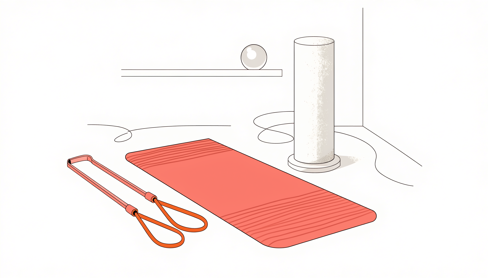

📌 3줄 요약
홈트 첫 장비는 "비싼 기구"가 아니라 "매일 손이 가는 작은 장비"부터다.

입문자에게는 요가매트·조절식 덤벨·폼롤러·저항밴드·운동 앱 조합이 가성비가 가장 좋다.

대형 기구(런닝머신 등)는 운동이 습관이 된 다음에 사도 늦지 않다.

홈트를 시작할 때 가장 많이 하는 실수가 비싼 런닝머신부터 사는 거예요. 그리고 두 달 뒤 그 위엔 빨래가 널려 있죠. 홈트 입문 첫 장비는 **매일 부담 없이 꺼내 쓰는 작은 장비**부터 갖추는 게 정답이에요. 이 글에서는 입문자가 처음 사면 후회가 적은 장비 5가지를 가성비·공간·활용도 기준으로 골라 드릴게요.

비싼 순서가 아니라 **실제로 자주 쓰게 되는 순서**로 정리했어요. 운동이 습관으로 자리 잡은 뒤에 큰 기구로 넘어가도 전혀 늦지 않아요.

## 첫 장비를 고르는 기준

장비를 고르기 전에, 입문자가 따져야 할 세 가지부터 짚을게요.

- **자주 쓰게 되는가** — 일주일에 한 번 쓸 기구보다, 매일 5분이라도 꺼내 쓸 장비가 낫다.
- **공간을 적게 먹는가** — 원룸·거실에서 굴러다니지 않고 구석에 세워둘 수 있는가.
- **활용도가 넓은가** — 한 가지 운동만 되는 것보다 전신을 두루 쓸 수 있는가.

이 세 가지를 통과하는 장비일수록 "사놓고 안 쓰는" 확률이 낮아요. 아래 5가지는 그 기준으로 추린 것들이에요.

## 한눈에 보는 입문 5종

| 장비 | 추천 이유 | 공간 | 우선순위 |
| --- | --- | --- | --- |
| 요가매트 | 모든 맨몸운동의 기본 바닥 | 작음(말아둠) | ★★★ |
| 조절식 덤벨 | 무게 조절로 오래 쓴다 | 작음 | ★★★ |
| 폼롤러 | 운동 전후 풀기·자세 교정 | 작음 | ★★ |
| 저항밴드 | 근력·재활·휴대 모두 | 매우 작음 | ★★ |
| 운동 앱 | 루틴·기록·동기부여 | 없음(폰) | ★★★ |

가격·구성은 자주 바뀌니, 구매 전 [쿠팡 홈트레이닝 용품](https://www.coupang.com/np/categories/178155) 등에서 현재 가격과 후기를 꼭 확인하세요.

## 1. 요가매트 — 가장 먼저 사야 할 바닥

홈트의 8할은 바닥에서 이뤄져요. 플랭크, 스트레칭, 코어 운동 전부 매트 한 장이 있어야 제대로 돼요. 맨바닥에서 하면 손목·무릎이 배기고, 층간소음도 신경 쓰이죠.

입문자는 **두께 6~10mm**가 무난해요. 너무 얇으면 무릎이 아프고, 너무 두꺼우면 균형 잡기가 어려워요. TPE 소재가 가볍고 냄새가 적어 입문용으로 흔히 추천돼요. 비싼 브랜드보다, 미끄럼 방지가 잘 되는지를 후기로 확인하는 게 더 중요해요.

## 2. 조절식 덤벨 — 한 번 사면 오래 쓰는 핵심

덤벨은 홈트에서 가장 활용도가 높은 장비예요. 다만 고정 무게 덤벨을 여러 쌍 사면 자리도 차지하고 돈도 더 들어요. 그래서 입문자에게는 **무게를 조절하는 조절식 덤벨**을 추천해요. 다이얼이나 핀으로 무게를 바꿔서, 한 세트로 가벼운 운동부터 점점 무거운 운동까지 커버할 수 있어요.

처음에는 본인 체감으로 "조금 버거운" 무게면 충분해요. 남성 입문자는 보통 한 손 5~10kg 범위에서 시작하고, 근력이 붙으면 무게를 올리면 돼요. 조절식이면 그때마다 새로 살 필요가 없다는 게 가장 큰 장점이에요.

## 3. 폼롤러 — 운동만큼 중요한 "풀기"

폼롤러는 운동 전후로 뭉친 근육을 풀고 자세를 잡는 데 써요. 입문자일수록 무리해서 다음 날 뻐근해지기 쉬운데, 폼롤러로 풀어주면 회복이 한결 수월해요. 책상에 오래 앉아 굳은 등·허벅지를 푸는 데도 좋고요.

표면이 너무 울퉁불퉁한 건 입문자에게 자극이 셀 수 있어요. 처음엔 **표면이 완만한 기본형**으로 시작해서, 익숙해지면 강한 타입으로 넘어가는 걸 추천해요. 부피는 있지만 가벼워서 구석에 세워두기 좋아요.

## 4. 저항밴드 — 작지만 활용 만점

저항밴드(루프밴드·튜브밴드)는 가격 대비 활용도가 가장 높은 장비 중 하나예요. 하체·어깨·등 운동을 도와주고, 재활이나 스트레칭 보조로도 써요. 무엇보다 **부피가 거의 없어** 서랍에 넣어두거나 여행에 챙겨갈 수 있어요.

강도가 여러 단계로 나뉜 세트를 고르면, 운동 부위와 숙련도에 맞춰 골라 쓸 수 있어요. 라텍스 알레르기가 있다면 직물 소재 밴드를 고르면 돼요. 덤벨이 부담스러운 입문 초기에 특히 유용해요.

## 5. 운동 앱 — 장비는 아니지만 가장 중요

장비를 다 갖춰도 "뭘 해야 할지" 모르면 금방 그만두게 돼요. 그래서 **운동 앱**이 사실상 첫 장비만큼 중요해요. 루틴을 짜주고, 운동을 기록하고, 꾸준함을 잡아줘요. 무료 앱만으로도 입문자에게는 충분한 경우가 많아요.

홈트 영상 루틴을 따라 하는 앱, 운동 기록·통계 앱, 스마트워치와 연동되는 앱 등 종류가 다양해요. 본인이 "매일 열게 되는" 앱이 가장 좋은 앱이에요. 어떤 앱이 맞는지는 직접 며칠 써보고 정하는 걸 추천해요.

## 아직 사지 말 것 (입문 단계)

- **대형 카디오 기구(런닝머신·실내자전거)** — 비싸고 자리도 크다. 운동이 습관이 된 뒤에 사도 늦지 않다.
- **너무 무거운 고정 덤벨 세트** — 금세 가볍거나 무거워서 안 쓰게 된다. 조절식이 낫다.
- **유행하는 신박한 기구** — 한 가지 동작만 되는 기구는 결국 방치되기 쉽다.

핵심은 "운동을 계속하게 만드는 작은 장비"부터예요. 습관이 자리 잡으면 그때 큰 투자를 해도 돼요.

## 자주 묻는 질문

**Q. 홈트 입문에 다 합쳐 얼마면 시작할 수 있나요?**
A. 요가매트·저항밴드·폼롤러는 각각 부담 없는 가격대이고, 조절식 덤벨이 가장 큰 비용이에요. 무리하지 말고 매트와 밴드부터 시작해도 충분해요. 정확한 가격은 시즌·구성에 따라 다르니 판매 페이지에서 확인하세요.

**Q. 덤벨부터 살까요, 매트부터 살까요?**
A. 매트부터예요. 맨몸운동과 스트레칭의 기본이라 가장 자주 쓰게 돼요. 덤벨은 맨몸운동이 익숙해진 뒤 더해도 됩니다.

**Q. 좁은 원룸인데 어떤 장비가 맞나요?**
A. 요가매트·저항밴드·조절식 덤벨처럼 부피가 작고 세워둘 수 있는 것 위주로 고르세요. 대형 기구는 공간을 많이 차지해 원룸엔 비추천이에요.

**Q. 장비 없이 앱만으로도 운동이 되나요?**
A. 됩니다. 맨몸운동 루틴만으로도 입문자에게는 충분해요. 앱으로 시작해서 필요할 때 매트·밴드를 더하는 순서도 좋아요.

---

**관련 키워드** — #홈트장비 #홈트입문 #운동기구추천 #조절식덤벨 #요가매트추천 #폼롤러추천 #저항밴드 #운동앱추천 #홈트레이닝 #가성비홈짐
