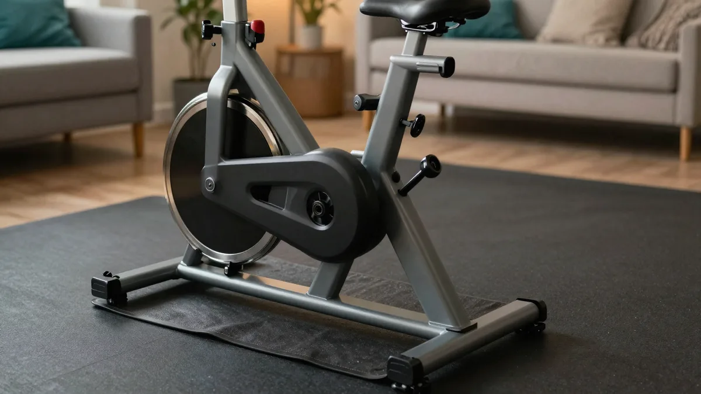

실내자전거 사려고 검색하면 스핀바이크에 좌식, 마그네틱에 마찰식까지 죄다 헷갈리죠. 저도 처음 찾아봤을 때 종류가 네댓 가지에 저항 방식까지 갈려서 뭘 골라야 할지 한참 헤맸어요. 결론부터 말하면요, 실내자전거는 비싼 스핀바이크부터 살 게 아니라 **내 상황(원룸이냐, 층간소음이 걱정이냐, 무릎이 약하냐, 예산이 얼마냐)에 맞춰 종류와 저항 방식을 고르는 물건**입니다. 이 글에서는 실내자전거 추천 기준을 종류·저항방식·소음·공간·예산으로 나누고, 사기 전에 꼭 알아야 할 안장 통증 같은 함정까지 스펙과 후기를 뒤져 한 번에 정리해 드릴게요.

📌 3줄 요약
실내자전거는 종류(스피닝·업라이트·좌식·미니)보다 <b>저항 방식(마그네틱 vs 마찰)</b>을 먼저 봐야 합니다. 소음과 수명이 여기서 갈려요.

아파트·빌라라면 <b>마그네틱 방식 + 방진매트</b>가 사실상 정답이고, 원룸이면 접이식, 무릎이 부담되면 등받이 있는 좌식이 기준입니다.

고강도로 땀 빼고 싶으면 무거운 플라이휠의 스피닝, 가볍게 몸만 움직이는 게 목적이면 미니 페달형. 안장 통증은 대부분 2주면 적응되니 겁먹지 마세요.

## 실내자전거, 어떤 종류부터 알아야 하나요?

**크게 스피닝·업라이트·좌식·미니 네 가지로 나뉩니다.** 이 구분만 잡아도 고르기가 훨씬 쉬워져요. 여기서 많이들 헷갈리는데, "실내자전거"와 "스피닝 자전거"를 같은 걸로 아는 경우가 많거든요. 둘은 자세도 강도도 다릅니다.

그래서 제가 종류별 특징을 표로 묶어봤습니다. 자기 목적에 맞는 줄부터 읽으면 돼요.

| 종류 | 자세·강도 | 이런 분께 | 공간 |
| --- | --- | --- | --- |
| 스피닝(스핀바이크) | 선 자세 가능, 고강도 | 땀 빼는 유산소, 하체 자극 | 큼(1.5×1.2m 이상) |
| 업라이트(입식) | 일반 자전거 자세, 중강도 | 표준적인 실내 라이딩 | 보통(50×100cm) |
| 좌식(리컴번트) | 등받이 기댄 자세, 저강도 | 무릎·허리 부담 줄이고 싶을 때 | 보통~큼 |
| 미니(페달 운동기) | 책상 밑에서 페달만 | 가볍게, 재택근무·시니어 | 매우 작음 |

스피닝은 무거운 플라이휠 덕에 페달링이 묵직하고 강도가 높아 칼로리 소모가 큰 편이고, 좌식은 등받이가 있어 오래 앉아 있어도 편합니다. 미니 페달형은 가장 저렴하고 작지만, 그만큼 강도가 낮아 "본격 운동"보다는 움직임 유지용에 가깝다는 점은 미리 알아두세요.

## 저항 방식이 왜 제일 중요한가요?

**소음과 수명이 저항 방식에서 갈리기 때문입니다.** 종류보다 이걸 먼저 봐야 해요. 실내자전거의 페달 무게를 만드는 방식은 크게 마그네틱(자석), 마찰(펠트 패드), 공기저항 세 가지인데, 이 선택이 조용하냐 시끄럽냐, 오래 가냐 금방 마모되냐를 결정합니다.

핵심만 정리하면 이렇습니다. 마그네틱은 자석을 가까이·멀리 움직여 저항을 주는 비접촉 방식이라 닿는 부분이 없어 거의 무소음이고 마모도 없습니다. 반면 마찰식은 패드가 바퀴에 직접 닿아 저항을 만드는 저가 방식이라, 값은 싸지만 소음이 크고 패드가 닳으면 교체해야 해요.

💡 저항 방식 한 줄 정리
<b>마그네틱</b>(자석·비접촉) — 거의 무소음, 마모 없음, 아파트 추천. 요즘 주력. <b>마찰식</b>(펠트 패드) — 저렴하지만 소음·패드 마모. 오래 쓸 거면 비추천. <b>공기저항</b>(에어바이크) — 밟을수록 바람 저항↑, 고강도용이지만 바람 소리 큼.

저도 처음엔 "저항이야 다 비슷하겠지" 하고 넘겼는데, 스펙을 비교해보니 이 방식 하나가 소음과 유지비를 다 좌우하더라고요. 오래 쓸 생각이면 마그네틱이 맘 편합니다.

## 층간소음 걱정되는데 아파트에서 써도 되나요?

**마그네틱 방식에 방진매트만 깔면 아파트에서도 충분히 씁니다.** 마그네틱은 비접촉이라 소음이 거의 없어요. 자료에 따라 다르지만 마그네틱 저항의 구동 소음은 대략 30dB 안팎으로, 조용한 환경에서도 부담이 적은 수준으로 소개됩니다.

여기에 두 가지만 더하면 층간소음 걱정을 거의 지울 수 있습니다. 첫째, 구동이 체인이 아니라 벨트 방식인 제품을 고르면 페달 돌아가는 소리가 더 조용해요. 둘째, 자전거 밑에 방진매트를 깔면 진동이 바닥으로 전달되는 걸 줄이고 바닥 긁힘도 막아 일석이조입니다.

정리하면, 소음이 걱정될 때 볼 순서는 마그네틱 저항 → 벨트 구동 → 방진매트예요. 이 셋을 챙기면 늦은 밤이나 새벽에도 무리 없이 탈 수 있습니다.

## 원룸인데 공간이 부족해요, 접이식이 답인가요?

**네, 원룸·오피스텔이라면 접이식이나 미니 페달형이 현실적인 답입니다.** 일반 실내자전거는 가로 1m 안팎 자리를 상시 차지하는데, 접이식은 안 쓸 때 세로로 접어 세워둘 수 있거든요. 접었을 때 폭이 30~44cm 수준까지 줄어드는 제품도 많습니다.

다만 트레이드오프는 있어요. 접이식은 일반형보다 대체로 2~3만 원 더 비싸고, 프레임이 가벼운 만큼 고강도로 오래 굴리면 안정성이 아쉬울 수 있습니다. 그래도 공간이 절대적으로 부족하다면 이 정도는 감수할 만한 값이에요.

더 극단적으로 좁으면 미니 페달 운동기도 방법입니다. 책상 밑에 두고 페달만 돌리는 형태라 부피가 가장 작고 값도 싸요. 대신 앞서 말했듯 강도가 낮아 "제대로 된 유산소"를 기대하긴 어렵다는 점은 감안하세요. 저도 이걸 몰라서 "작고 싼 게 최고"인 줄 알았다가, 강도가 아쉽다는 후기를 뒤늦게 봤거든요.

## 플라이휠은 무거울수록 좋은가요?

**무거울수록 페달링이 부드럽지만, 소음·무게와의 맞바꿈입니다.** 플라이휠은 페달과 연결된 회전 바퀴인데, 무거우면 관성이 커져서 페달이 툭툭 끊기지 않고 매끄럽게 돌아갑니다. 그래서 스피닝처럼 강도 높게 타는 제품일수록 무거운 플라이휠을 씁니다.

여기서 오해 하나 짚을게요. "플라이휠이 무거우면 무조건 좋다"고 보는 분이 많은데, 무거운 플라이휠은 그만큼 본체가 무겁고 진동·소리도 커질 수 있습니다. 조용히 가볍게 타려는 사람에겐 오히려 과할 수 있어요.

그래서 기준은 이렇게 잡으면 됩니다. 고강도로 땀 빼는 게 목적이면 무거운 플라이휠의 스핀바이크, 조용히 꾸준히 도는 게 목적이면 굳이 무거운 플라이휠을 고집할 필요 없이 마그네틱 업라이트·좌식으로 충분합니다.

## 무릎·허리가 부담되면 뭘 골라야 하나요?

**등받이가 있는 좌식(리컴번트) 형태가 부담이 덜한 자세입니다.** 좌식은 의자처럼 기대앉아 다리를 앞으로 뻗어 페달을 밟는 구조라, 허리를 세우고 타는 업라이트보다 관절에 실리는 부담이 적은 편으로 소개됩니다. 그래서 시니어나 오래 앉아 편하게 타고 싶은 분들이 많이 찾아요.

다만 여기서 솔직하게 밝힐 게 있습니다. 저는 운동기구를 비교·리뷰하는 사람이지 의료 전문가가 아니에요. 무릎이나 허리에 실제 통증·부상이 있다면 기구 선택 이전에 전문의 상담이 먼저입니다. 이 글은 어디까지나 "어떤 형태가 자세상 부담이 덜하다고 알려져 있는가"를 정리한 것이지, 치료나 재활을 보장하는 얘기가 아닙니다.

자세가 편한 대신 좌식은 강도를 크게 올리기 어렵다는 한계도 있어요. 편안함과 강도는 어느 정도 맞바꿈이라는 점을 알고 고르면 됩니다.

## 안장이 아프다던데, 사기 전에 알아야 할 함정은?

**대부분 첫 2주 적응기의 문제라 겁먹을 필요는 없습니다.** 실내자전거를 처음 타면 엉덩이·안장 접촉 부위가 아픈 경우가 흔한데, 후기들을 보면 보통 2주 정도면 적응된다는 얘기가 많아요. 자세와 안장 높이가 맞으면 통증은 대개 줄어듭니다.

그래도 통증이 계속되면 돈 크게 안 들이고 잡는 방법이 있습니다. 젤 안장 커버(대략 1~2만 원)를 씌우거나, 패딩이 들어간 사이클 팬츠를 입으면 체감이 크게 달라져요. 안장 높이는 페달을 가장 아래로 내렸을 때 무릎이 살짝 굽혀지는 정도가 적정선입니다.

⚠️ 협찬 글이 잘 안 알려주는 것
추천 글들이 "무소음·고급"만 강조하고 넘어가는 실사용 함정 세 가지 — ① 저가 마찰식은 <b>패드가 닳으면 소음이 커지고 교체가 필요</b>합니다. ② 조립이 필요한 제품이 많아 <b>초기 조립 난이도·유격</b>을 후기에서 확인하세요. ③ 미니·초저가형은 <b>강도 조절 폭이 좁아</b> 금방 시시해질 수 있어요.

## 예산은 얼마를 잡아야 하나요?

**입문은 11만~18만 원대, 튼튼한 걸 오래 쓸 거면 20만 원 이상을 잡으면 됩니다.** 가격대별로 뭘 기대할 수 있는지 대략 정리하면 이래요. 단, 가격은 시기·판매처에 따라 자주 바뀌니 정가 기준 참고용으로만 보세요.

| 가격대 | 기대치 | 비고 |
| --- | --- | --- |
| 11만~14만 원 | 접이식·미니, 기본 마그네틱 | 입문·가벼운 유산소 |
| 16만~20만 원 | 안정적 마그네틱, 좌식·업라이트 | 가장 무난한 구간 |
| 20만~33만 원 | 무거운 플라이휠 스핀바이크, 견고한 프레임 | 고강도·장기 사용 |

저도 처음엔 무조건 싼 걸 찾았는데, 후기를 뒤져보니 너무 저가는 유격·소음으로 금방 후회하는 경우가 많더라고요. 오래 탈 생각이면 16만 원대 이상 마그네틱 제품이 실패 확률이 낮습니다.

## 실내자전거 추천, 한눈에 정리

상황별로 뭘 고르면 되는지 결정표로 묶었습니다. 자기에게 맞는 줄만 보면 돼요.

| 내 상황 | 추천 종류·방식 |
| --- | --- |
| 아파트·층간소음 걱정 | 마그네틱 + 벨트 구동 + 방진매트 |
| 원룸·공간 부족 | 접이식 마그네틱, 극협소는 미니 페달형 |
| 고강도로 땀 빼고 싶음 | 무거운 플라이휠 스핀바이크 |
| 무릎·허리 부담 최소화 | 등받이 있는 좌식(리컴번트) |
| 예산 최우선 | 11만~14만 원대 접이식 마그네틱 |

이거 하나만 기억하면 돼요. **종류보다 저항 방식(마그네틱)을 먼저 보고, 내 공간과 층간소음 상황에 맞춰 고른다.** 정확한 모델별 가격·재고는 자주 바뀌니 [쿠팡 홈트레이닝 용품](https://www.coupang.com/np/categories/178155) 같은 판매 페이지에서 직접 확인하세요. 실내자전거와 함께 홈트를 시작한다면 [홈트 입문 기구 정리](/home-workout-beginner-gear/) 글도 같이 보면 도움이 될 거예요.

## 자주 묻는 질문

**Q. 실내자전거는 마그네틱과 마찰식 중 뭐가 나아요?**
A. 오래 쓸 거면 마그네틱이에요. 자석으로 저항을 주는 비접촉 방식이라 소음이 거의 없고 마모될 부품이 없거든요. 마찰식은 값이 싸지만 패드가 바퀴에 닿아 소리가 나고, 패드가 닳으면 교체해야 합니다. 아파트라면 마그네틱이 사실상 정답입니다.

**Q. 아파트에서 층간소음 없이 타려면 어떻게 해야 하나요?**
A. 마그네틱 저항에 벨트 구동 제품을 고르고, 밑에 방진매트를 까는 게 핵심이에요. 이 셋을 갖추면 진동과 소음이 크게 줄어 늦은 밤에도 부담이 적습니다. 마그네틱 구동 소음은 자료 기준 대략 30dB 안팎으로 조용한 편으로 소개됩니다.

**Q. 원룸인데 접이식이 정말 쓸 만한가요?**
A. 공간이 부족하면 접이식이 현실적인 선택이에요. 접으면 폭이 30~44cm 수준까지 줄어 세워둘 수 있습니다. 다만 일반형보다 2~3만 원 비싸고 고강도로 오래 굴리면 안정성이 아쉬울 수 있으니, 격한 운동보다 가벼운 유산소 위주라면 잘 맞아요.

**Q. 안장이 너무 아픈데 실내자전거가 안 맞는 걸까요?**
A. 대부분 초기 2주 적응기의 문제라 조금 타면 나아지는 경우가 많아요. 그래도 아프면 젤 안장 커버(1~2만 원)나 패딩 사이클 팬츠로 크게 완화됩니다. 안장 높이를 페달 최하단에서 무릎이 살짝 굽혀지는 정도로 맞추는 것도 중요해요.

**Q. 미니 페달 운동기로도 운동이 되나요?**
A. 가볍게 움직임을 유지하는 용도로는 괜찮지만, 강도는 낮은 편이에요. 책상 밑에서 페달만 돌리는 구조라 부피와 가격은 최고로 작지만, 제대로 땀 빼는 유산소를 원한다면 업라이트나 스피닝이 맞습니다. 재택근무 중 다리 움직임용으로 생각하면 실망이 없어요.

---

**관련 키워드** — #실내자전거추천 #스핀바이크 #마그네틱실내자전거 #층간소음실내자전거 #접이식실내자전거 #좌식자전거 #리컴번트 #무소음실내자전거 #홈트유산소 #미니자전거 #실내자전거고르는법 #원룸운동기구
