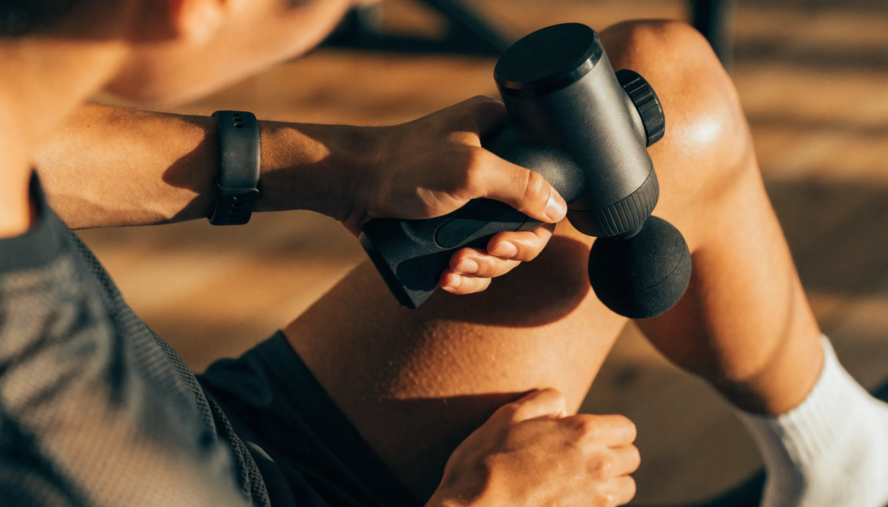

마사지건 사려고 검색하면 "3600 RPM! 20단 강도!" 같은 숫자가 쏟아지죠. 저도 처음엔 그 숫자가 클수록 좋은 줄 알았는데, 스펙을 비교해보니 함정이 있었어요. 결론부터 말하면요, 마사지건은 **분당 타격수(RPM)가 아니라 진폭(스트로크)** 이 실제 시원함을 좌우하고, 그다음은 예산대에 맞춰 고르면 됩니다. 입문이라면 국산 가성비로도 충분하고, 굳이 40만 원짜리 프리미엄부터 살 필요는 없어요. 이 글에서는 마사지건 추천 기준을 진폭·스톨력·소음·무게로 나누고, 3만·10만·40만 원대 예산별로 뭘 사야 하는지와 하면 안 되는 부위까지 정리해 드릴게요.

📌 3줄 요약
마사지건은 RPM(타격 횟수)이 아니라 <b>진폭(스트로크 mm)</b>이 심부 자극을 좌우합니다. 저가 6~10mm, 중급 10~12mm, 프로급 14~16mm가 기준이에요.

예산별로 <b>3만 원대 입문 · 10만 원대 국산 가성비 · 40만 원대 프리미엄</b>으로 갈리고, 일반인은 10만 원대에서 대부분 해결됩니다.

목 앞·척추 뼈·손목·복부·관절 등은 절대 대면 안 되는 부위라 이건 꼭 알고 쓰세요.

## 마사지건, 뭘 먼저 봐야 하나요?

고르기 전에 다섯 가지만 보면 됩니다. 진폭, 스톨력, 소음, 무게, 그리고 헤드예요. 여기서 많이들 헷갈리는데, 마케팅이 앞세우는 RPM·강도 단수보다 이 다섯 개가 실제 만족도를 결정합니다.

**진폭**은 타격 헤드가 앞뒤로 움직이는 거리(mm)입니다. 이게 깊이를 만들어요. **스톨력**은 눌러도 모터가 멈추지 않는 힘이고, **소음**은 조용한 집에서 특히 중요하죠. **무게**는 너무 가벼우면 힘이 안 실리고 너무 무거우면 팔이 아픕니다. **헤드**는 부위에 맞춰 갈아 끼우는 팁이고요.

## RPM보다 진폭 — 여기서 속지 마세요

가장 중요한 포인트라 따로 짚을게요. 광고는 "3600 RPM"처럼 분당 타격수를 크게 내세우는데, 사실 근막 깊이까지 닿는 자극은 **진폭**이 더 크게 좌우합니다. 진폭이 짧으면 아무리 빨리 떨려도 표면만 두드리는 느낌이에요.

기준을 표로 묶어봤습니다.

| 진폭 | 등급 | 느낌 |
| --- | --- | --- |
| 6~10mm | 입문·저가 | 진동 안마 수준, 가벼운 결림 완화 |
| 10~12mm | 중급 | 근막까지 어느 정도 도달, 일반인 만족 구간 |
| 14~16mm | 프로급 | 심부 근육까지, 운동선수·대근육용 |

스톨력도 함께 봅니다. 제조사 스펙 기준으로 일반인은 20kg 안팎이면 충분하고, 대퇴사두처럼 크고 단단한 근육을 자주 쓰는 분이라면 27kg 이상 프로급이 유리해요. 저도 이 두 숫자를 알고 나니 스펙표가 갑자기 읽히더라고요.

모터도 한 가지만 알아두면 좋습니다. 흔한 **DC 모터**는 저렴하지만 상대적으로 소음이 크고 수명이 짧은 편이고, **BLDC(브러시리스) 모터**는 조금 더 비싼 대신 조용하고 오래갑니다. 밤에 자주 쓰거나 층간소음이 신경 쓰이면 BLDC 쪽이 확실히 유리해요.

## 예산대별 추천 — 3만 · 10만 · 40만 원대

마사지건은 가격 폭이 커서 예산부터 정하면 선택이 단순해집니다. 예산대별로 기대치를 정리했어요.

| 예산대 | 기대할 수 있는 것 | 이런 분께 |
| --- | --- | --- |
| 3만 원대(입문) | 진동 안마 + 가벼운 이완, 진폭 짧음 | 어깨·종아리만 가끔 푸는 라이트 유저 |
| 10만 원대(국산 가성비) | 진폭 10~12mm·헤드 여러 개·긴 배터리 | 홈트 후 회복을 챙기는 대부분의 사람 |
| 40만 원대+(프리미엄) | 진폭 14~16mm·높은 스톨력·저소음 BLDC | 헤비 유저·대근육·운동선수 |

여기서 솔직히 말하면요, **헤비 유저가 3만 원대를 사면 금방 아쉬워지고, 라이트 유저가 40만 원대를 사면 과투자**예요. 대부분은 10만 원대 국산 가성비에서 진폭 10~12mm·헤드 여러 개 되는 제품이면 충분합니다. 가격은 시기·판매처에 따라 자주 바뀌니 참고 수준으로 보시고요.

브랜드로 감을 더 잡아볼게요. 국산 가성비 쪽은 **제스파·보아르·클럭·홈플래닛** 같은 이름이 후기에 자주 보이고, 프리미엄은 **하이퍼볼트(하이퍼아이스)·테라건(테라바디)** 이 대표적이고, 같은 브랜드도 하이퍼볼트 Go·2 Pro, 테라건 미니·프라임처럼 라인이 갈립니다. 다만 저는 특정 모델을 "이거 하나 사세요"라고 콕 집지는 않을게요. 같은 브랜드도 라인업마다 진폭·스톨력이 제각각이라, 안 써본 제품을 추천하는 것보다 위에서 본 **진폭 10mm+·무게 700g~1kg** 기준으로 실제 스펙표를 보고 고르는 게 훨씬 정확하거든요.

💡 이거 하나만 기억하면
스펙표에서 <b>RPM·강도 단수는 대충 보고, 진폭(mm)과 무게(g)를 먼저</b> 보세요. 진폭 10mm 이상·무게 700g~1kg이면 일반적인 회복 용도로는 대부분 만족합니다. 20단 강도 같은 건 체감차가 크지 않은 과잉 스펙일 때가 많아요.

## 미니 vs 풀사이즈 — 뭘 사야 하나

크기도 갈립니다. **풀사이즈**(900g~1.2kg)는 스톨력이 높고 깊게 풀리지만, 셀프로 등이나 어깨를 할 때 무게가 부담이에요. **미니·휴대용**(380~700g)은 가방에 쏙 들어가 출장·헬스장에 좋지만 진폭과 힘이 제한적입니다.

정리하면, 집에서 대근육까지 제대로 풀 거라면 풀사이즈, 어깨·종아리 위주로 가볍게 들고 다닐 거라면 미니가 맞습니다. 예산이 되면 둘을 병용하는 분도 있고요.

## 헤드(팁) 종류와 용도

헤드는 부위에 맞춰 갈아 끼웁니다. 종류가 많아 보여도 쓰임은 단순해요.

- **볼(원형)** — 전신 넓은 근육 범용. 가장 자주 씁니다.
- **평면(플랫)** — 근육과 뼈 경계, 대근육에 무난.
- **포크(U자)** — 목·척추 양옆 라인을 뼈를 피해서.
- **원형·불릿(포인트)** — 발바닥·손·뭉친 한 점을 집중.

입문이라면 볼과 평면만 있어도 충분하고, 헤드가 4종 이상이면 대부분의 부위를 커버합니다.

## 올바른 사용법과 시간

세게 오래 한다고 좋은 게 아닙니다. 한 부위당 **30초에서 1분** 정도, 약한 강도로 시작해 천천히 움직이는 게 요령이에요. 한곳에 오래 고정하지 말고 근육을 따라 부드럽게 훑어줍니다. 익숙해지면 강도를 조금씩 올리고, 사용 후에는 가벼운 스트레칭을 곁들이면 좋습니다. 처음부터 최고 강도로 대면 오히려 멍이 들 수 있으니 주의하세요.

## 이것만은 주의 — 하면 안 되는 부위

제품 고르는 것만큼 중요한 게 안전입니다. 순위글은 이 부분을 자주 빼먹는데, 잘못 대면 다칩니다.

⚠️ 마사지건을 대면 안 되는 부위
① <b>목 앞·옆(경동맥)</b> — 혈관·신경이 지나 위험합니다. ② <b>척추 뼈 위</b> — 뼈를 직접 타격하지 마세요(척추 양옆 근육만). ③ <b>손목·팔꿈치 안쪽 등 동맥 부위</b> ④ <b>복부·옆구리(신장·장기)</b> ⑤ <b>무릎·팔꿈치 등 관절과 뼈 돌출부</b> ⑥ <b>멍들었거나 다친 곳</b>. 이 부위들은 근육이 아니라 신경·혈관·장기·뼈라 타격 대상이 아니에요. 사용 중 어지럽거나 메스꺼우면 즉시 멈추세요.

골다공증·골절이 있거나 혈전·혈관 질환, 임신 중이라면 사용 전에 특히 조심해야 합니다. 마사지건은 근육을 풀어주는 도구이지 통증 치료 기기가 아니라는 점만 기억하면 됩니다.

## 한눈에 정리

| 항목 | 이렇게 고르세요 |
| --- | --- |
| 진폭 | 10mm 이상(심부는 12mm+) |
| 스톨력 | 일반 20kg·대근육 27kg+ |
| 무게 | 700g~1kg |
| 소음 | 65dB 이하면 정숙 |
| 헤드 | 4종 이상(볼·평면 필수) |
| 예산 | 대부분 10만 원대 국산 가성비면 충분 |

실제 판매 제품과 최신 가격은 [쿠팡 마사지건](https://www.coupang.com/np/search?q=마사지건)에서 확인하는 게 정확합니다.

## 자주 묻는 질문 (FAQ)

**Q. 마사지건 입문자는 어떤 걸 사야 하나요?**
A. 10만 원대 국산 가성비 제품에서 진폭 10~12mm, 헤드 4종 이상, 무게 700g~1kg이면 대부분 만족합니다. 어깨·종아리만 가볍게 풀 거면 3만 원대 미니도 괜찮지만, 홈트 후 회복까지 챙기려면 10만 원대가 실패가 적습니다.

**Q. RPM이 높을수록 좋은 건가요?**
A. 아닙니다. 분당 타격수(RPM)보다 진폭(스트로크 mm)이 심부 자극을 더 좌우합니다. 진폭이 짧으면 아무리 RPM이 높아도 표면만 두드리는 느낌이라, 스펙표에서는 진폭을 먼저 보세요.

**Q. 마사지건 소음 많이 큰가요?**
A. 구조상 진동이라 소음은 필연이지만, 65dB 이하면 일반 대화 수준으로 조용한 편입니다. 저가 제품을 최고 단계로 쓰면 70~80dB까지 커질 수 있어, 밤이나 층간소음이 걱정이면 BLDC 모터 제품이 유리합니다.

**Q. 마사지건 하루에 얼마나 쓰면 되나요?**
A. 한 부위당 30초에서 1분 정도, 약한 강도로 시작해 근육을 따라 천천히 훑어주는 게 좋습니다. 한곳에 오래 고정하거나 과하게 쓰면 멍·통증이 생길 수 있으니 주의하세요.

**Q. 목이 뭉쳤는데 마사지건으로 풀어도 되나요?**
A. 목 앞·옆은 경동맥과 신경이 지나 마사지건을 대면 안 됩니다. 뭉친 승모근(어깨와 목 사이 근육)이나 등 위쪽은 조심해서 쓸 수 있지만, 목 앞쪽과 척추 뼈 위는 반드시 피하세요.

자, 이거 하나만 기억하면 돼요. 마사지건은 RPM 숫자가 아니라 **진폭(10mm 이상)과 예산대**로 고르고, 대부분은 10만 원대 국산 가성비면 충분합니다. 목 앞·척추·관절만 피하면 크게 위험할 일도 없고요. 폼롤러와 함께 회복 장비를 갖추는 중이라면 [폼롤러 추천](/foam-roller-recommend/) 글도 이어서 보시면 조합이 쉬워집니다.

#마사지건추천 #마사지건고르는법 #마사지건진폭 #입문마사지건 #가성비마사지건 #미니마사지건 #마사지건소음 #마사지건사용법 #마사지건주의사항 #근막이완 #회복장비 #마사지건가격
