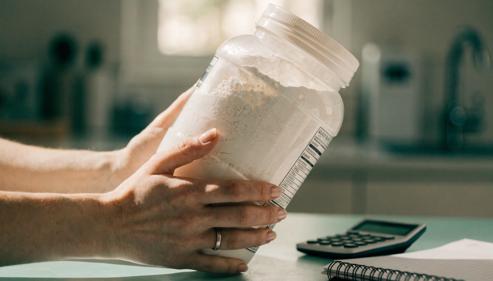

**단백질 보충제 추천** 글을 찾아보면 브랜드 이름만 잔뜩 나오는데, 정작 내 몸에 WPC가 맞는지 WPI가 맞는지는 아무도 안 알려주죠. 저도 처음 찾아봤을 때 통 뒤의 알파벳 세 글자가 제품마다 달라서 한참 헤맸어요. 결론부터 말하면요, 단백질 보충제는 **① 소화 능력으로 종류(WPC/WPI)를 정하고 → ② 라벨에서 1회 단백질 함량과 당류를 확인하고 → ③ 통 가격이 아니라 단백질 1g당 가격으로 비교**하면 실패하지 않습니다. 한국소비자원 시험에서 단백질 1g당 가격이 제품 간 **최대 11.7배**까지 벌어졌거든요. 이 3단계를 순서대로 풀어보겠습니다.

📌 3줄 요약
우유를 잘 소화하면 <b>WPC(가성비)</b>, 우유 마시면 배가 불편하면 <b>WPI(유당 제거)</b>가 기본 공식입니다.

라벨에서 볼 건 세 가지 — <b>1회 단백질 함량(20g 안팎), 당류, 아미노산스코어</b>. 소비자원 시험에서 당류가 제품 간 <b>최대 105배</b> 차이 났습니다.

가격 비교는 통 가격이 아니라 <b>단백질 1g당 가격</b>으로 하세요. 같은 시험에서 1g당 32원부터 375원까지 갈렸어요.

## 단백질 보충제, 뭐부터 봐야 하나요?

**브랜드가 아니라 내 소화 능력부터 봐야 합니다.** 단백질 보충제 선택에서 가장 많은 실패가 "남들이 좋다는 제품"을 샀다가 배탈이 나거나, 당류 범벅 제품을 모르고 사는 경우거든요. 순서는 간단합니다. 종류(소화) → 라벨(함량·당류) → 가격(1g당) 세 단계예요.

이 글은 특정 제품을 밀지 않습니다. 대신 어떤 제품을 집어 들어도 스스로 판단할 수 있는 기준을 정리했어요. 참고로 여기서 다루는 건 운동 보조용 "사는 물건"으로서의 보충제 고르는 법이고, 질환이 있거나 식단 전반이 고민이라면 전문의·영양 전문가와 상담하는 게 우선입니다.

## WPC·WPI·WPH는 뭐가 다른가요?

**유청단백질을 얼마나 걸러냈느냐의 차이입니다.** 우유에서 뽑은 유청을 농축만 하면 WPC, 유당·지방을 한 번 더 걸러내면 WPI, 효소로 미리 분해까지 하면 WPH가 돼요. 스펙을 비교해보니 이렇게 정리됩니다.

| 구분 | WPC(농축) | WPI(분리) | WPH(가수분해) |
| --- | --- | --- | --- |
| 단백질 순도 | 70~80% | 90% 이상 | 고순도(분해 처리) |
| 유당 | 포함 | 거의 없음 | 최소화 |
| 가격 | 저렴 | 중간~비쌈 | 가장 비쌈 |
| 맛 | 고소하고 부드러움 | 상대적으로 밍밍 | 쓴맛이 있는 편 |
| 어울리는 사람 | 우유 소화 잘 되는 입문자 | 유당불내증·다이어터 | 소화가 특히 예민한 경우 |

여기서 많이들 헷갈리는데, 순도가 높다고 무조건 좋은 게 아닙니다. 우유를 잘 소화하는 사람에겐 WPC가 가성비로 정답에 가깝고, WPI·WPH의 가치는 유당을 걸러냈다는 데 있어요. 내 몸이 필요로 하지 않는 공정에 웃돈을 낼 이유는 없습니다.

## 유당불내증이면 어떤 걸 골라야 하나요?

**WPI가 기본, 더 예민하면 WPH, 유제품 자체를 피하고 싶다면 식물성(ISP)입니다.** 우유만 마시면 배가 부글거리는 유당불내증이라면 유당이 남아 있는 WPC는 피하는 게 안전해요. WPI는 유당을 거의 제거해서 이 문제를 크게 줄였고, WPH는 단백질을 잘게 분해해 소화 부담을 더 낮춘 형태입니다.

콩에서 뽑은 분리대두단백(ISP) 같은 식물성 단백질도 선택지입니다. 유당 걱정이 없고 가격도 괜찮은 편인데, 유청 대비 아미노산 구성이 아쉽다는 평가가 있어 라벨의 아미노산스코어를 확인하고 고르는 게 좋아요. 실제로 소비자원 시험에서 식물성 음료 제품 하나가 아미노산스코어 45로 최저를 기록하기도 했습니다.

## 라벨에서 확인할 3가지 — 함량·당류·아미노산스코어

**통 앞면 광고 말고 뒷면 영양정보표를 보세요.** 한국소비자원이 단백질 보충 식품 16개(분말 8·음료 8)를 시험한 결과가 좋은 근거가 됩니다. 제가 수치를 표로 묶어보면 이렇습니다.

| 항목 | 시험 결과(1회 섭취량 기준) | 시사점 |
| --- | --- | --- |
| 단백질 함량 | 제품당 4~29g, 최대 7.3배 차이 | "단백질" 이름만 믿지 말고 g 수 확인 |
| 당류 | 0.2~20.9g, **최대 105배 차이** | 맛있는 제품일수록 당류 확인 필수 |
| 아미노산스코어 | 16개 중 14개가 85 이상 | 85 미만이면 단백질 질이 아쉬운 편 |
| 안전성 | 전 제품 중금속·미생물 기준 적합 | 안전성보다 함량·당류가 실제 변별점 |

아미노산스코어는 필수 아미노산이 얼마나 고르게 들었는지를 보는 지표로, 건강기능식품 기준이 85 이상입니다. 일반식품형 보충제엔 이 기준이 강제되지 않아서, 라벨이나 상세페이지에 표기돼 있다면 확인하고 고르는 게 유리해요.

## 가격은 통 가격이 아니라 1g당 가격으로

**계산법은 하나입니다. 제품 가격 ÷ 총 단백질 g.** 예를 들어 2kg에 5만 원짜리 제품의 1회분(30g)당 단백질이 24g이라면, 총 단백질은 약 1,600g이고 1g당 약 31원이 되는 식이죠. 같은 소비자원 시험에서 단백질 1g당 가격이 32원부터 375원까지 **11.7배** 차이 났는데, 대체로 분말형이 저렴하고 음료형이 비쌌습니다.

여기서 많이들 놓치는 게 "한 통 가격"의 함정이에요. 통이 크고 싸 보여도 1회분 단백질이 적으면 실제로는 비싼 제품일 수 있습니다. 저도 스펙을 비교해보니 저렴해 보이던 제품이 1g당 가격으론 뒤로 밀리는 경우가 꽤 있더라고요. 계산기 한 번이면 끝나니 장바구니에 넣기 전에 꼭 나눠보세요.

💡 1분 계산 습관
<b>가격 ÷ (1회분 단백질 g × 회분 수) = 1g당 가격.</b> 이 숫자 하나로 분말·음료·브랜드 불문 공정한 비교가 됩니다.

## 분말형과 음료형, 뭐가 나은가요?

**꾸준히 먹는 용도면 분말형, 휴대·간편함이 우선이면 음료형입니다.** 시험 데이터가 보여주듯 가성비는 분말형이 압도적입니다(1g당 저가 구간 32~33원이 전부 분말형). 대신 물이나 우유에 타야 하고 쉐이커 관리가 필요하죠. 음료형은 뚜껑만 따면 되는 편의성이 장점이지만 1g당 가격이 몇 배로 뛰고, 마시기 좋게 만드느라 당류가 높은 제품이 섞여 있어요.

현실적인 조합은 집·헬스장용 분말 + 외출용 음료 정도의 역할 분담입니다. 음료형을 고를 땐 위 라벨 3종 세트(함량·당류·스코어) 확인이 더 중요해집니다.

## 얼마나 먹어야 하나요?

**보충제는 어디까지나 식사로 모자란 만큼만 채우는 용도입니다.** 일반적으로 알려진 참고 범위는 체중 1kg당 일반 성인 0.8~1.2g, 운동을 꾸준히 하는 경우 1.4~2.2g 수준인데, 개인차가 커서 절대 기준은 아니에요. 식사에서 이미 충분히 먹고 있다면 보충제를 더할 이유가 없습니다.

⚠️ 많이 먹는다고 좋은 게 아닙니다
과다 섭취는 몸에 부담이 될 수 있다는 전문가 지적이 있고, 특히 <b>신장 질환 등 기저질환이 있다면 섭취 전 전문의와 상담</b>이 우선입니다. 제품 라벨의 1회 섭취량을 넘겨 먹는 것도 권장되지 않아요.

단백질을 포함한 하루 식단 비율이 궁금하다면 [다이어트 식단 탄단지 비율 글](/diet-macro-ratio/)에서 계산법을 정리해뒀으니 함께 보시면 좋습니다. 소비자원 시험 상세 내용은 [하이닥의 결과 기사](https://news.hidoc.co.kr/news/articleView.html?idxno=30562)에서 확인할 수 있어요.

## 한눈에 정리 — 상황별 단백질 보충제 결정표

**내 상황 줄만 찾으면 됩니다.**

| 상황 | 추천 종류 | 추가로 볼 것 |
| --- | --- | --- |
| 우유 소화 잘 됨 + 가성비 | WPC 분말 | 1g당 가격(소비자원 저가 구간이 32~33원이었던 걸 기준 삼으면 30~60원대는 준수한 편이라는 게 제 판단) |
| 우유 마시면 배 불편 | WPI | 유당 함량 표기 |
| 소화가 특히 예민 | WPH | 가격 대비 필요성 판단 |
| 유제품 자체를 피하고 싶음 | 식물성(ISP 등) | 아미노산스코어 |
| 다이어트 중 | WPI 또는 저당 제품 | 당류(시험 최저가 0.2g대였으니 한 자릿수 초반 위주로 보자는 게 제 기준) |
| 휴대·간편이 최우선 | 음료형 | 당류·1g당 가격 |

이거 하나만 기억하면 돼요. **종류는 소화력으로, 품질은 라벨로, 가격은 1g당으로.** 이 세 줄이면 어떤 신제품이 나와도 스스로 판단할 수 있습니다.

## 자주 묻는 질문 (FAQ)

**Q. 헬스 초보인데 WPC와 WPI 중 뭘 사야 하나요?**
A. 우유를 잘 소화한다면 WPC로 시작하는 게 가성비상 무난합니다. 단백질 순도는 WPI가 높지만, WPI의 핵심 가치는 유당 제거라서 유당불내증이 없다면 웃돈의 효용이 크지 않아요. 우유 마시고 배가 불편했던 적이 있다면 처음부터 WPI를 고르세요.

**Q. 유당불내증인데 단백질 보충제를 먹을 수 있나요?**
A. 가능합니다. 유당을 거의 제거한 WPI, 소화 부담을 더 낮춘 WPH, 유제품이 아닌 식물성(ISP) 제품이 선택지예요. 라벨의 유당 함량 표기를 확인하고, 그래도 불편이 반복되면 섭취를 중단하고 전문가와 상담하는 게 안전합니다.

**Q. 아미노산스코어가 뭔가요?**
A. 필수 아미노산이 얼마나 고르게 들어 있는지 보여주는 단백질 품질 지표입니다. 건강기능식품 기준은 85 이상이고, 소비자원 시험에선 16개 중 14개 제품이 85를 넘겼습니다. 일반식품형 보충제는 이 기준이 강제가 아니라서, 표기돼 있다면 확인하고 고르는 게 유리해요.

**Q. 하루에 몇 스쿱을 먹어야 하나요?**
A. 정해진 답은 없고 제품 라벨의 1회 섭취량과 내 식사량에 따라 달라집니다. 식사로 부족한 만큼만 보충하는 게 원칙이고, 라벨 권장량을 초과해 먹는 건 권장되지 않아요. 기저질환이 있다면 섭취 전 전문의 상담이 우선입니다.

**Q. 식물성 단백질 보충제는 유청보다 못한가요?**
A. 못하다기보다 성격이 다릅니다. 유당 걱정이 없고 채식 지향과도 맞지만, 제품에 따라 아미노산 구성이 유청 대비 아쉬울 수 있어요. 실제 소비자원 시험에서 식물성 음료 제품이 아미노산스코어 최저(45)를 기록한 사례가 있으니, 식물성을 고를수록 스코어 표기를 확인하는 게 중요합니다.

---

**관련 키워드** — #단백질보충제추천 #프로틴추천 #WPC #WPI #WPH차이 #유당불내증프로틴 #단백질보충제고르는법 #아미노산스코어 #프로틴가격비교 #헬스보충제 #식물성단백질 #프로틴초보
