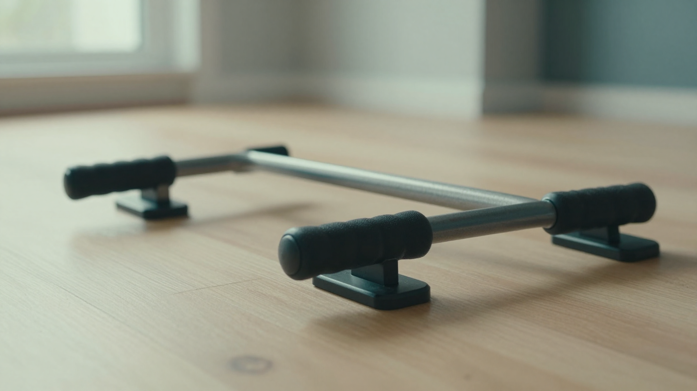

푸쉬업바 추천 글을 찾아보면 표준형·회전형·멀티형에 원판형까지, 종류가 너무 많아서 뭘 골라야 할지 막막하죠. 저도 처음 찾아봤을 때 회전형이 무조건 좋다는 글과 오히려 고정형이 낫다는 글이 섞여 있어서 한참 헤맸어요. 결론부터 말하면요, **푸쉬업바 추천의 핵심은 손목 보호와 안정성**이고, 회전형이냐 고정형이냐는 그다음 취향 문제입니다. 이 글에서는 종류별 차이부터 회전형과 고정형 중 뭘 사야 하는지, 초보가 실패 없이 고르는 기준까지 스펙과 후기를 뒤져 정리했습니다.

📌 3줄 요약
푸쉬업바를 쓰는 가장 큰 이유는 손목 꺾임을 줄이고 가동범위를 넓혀 가슴 자극을 키우는 것입니다.

초보라면 <b>넓은 바닥·미끄럼방지가 확실한 고정형(표준·원판)</b>부터가 안전하고, 회전형은 손목 자유도를 원할 때 다음 단계로 좋습니다.

가격은 시기·구성에 따라 자주 바뀌니 대략 가격대로만 참고하고 판매 페이지에서 확인하세요.

## 푸쉬업바, 꼭 필요한가요?

결론부터 말하면 손목이 불편하거나 가슴 자극을 더 키우고 싶다면 살 가치가 있습니다. 맨손 팔굽혀펴기는 손을 바닥에 대는 순간 손목이 거의 90도로 꺾이는데, 이 자세가 반복되면 손목에 부담이 쌓여요. 푸쉬업바는 손잡이를 잡는 중립 그립을 만들어 이 꺾임을 줄여줍니다.

두 번째 이유는 가동범위입니다. 바닥보다 손 위치가 높아지니 내려갈 때 가슴을 더 깊게 스트레치할 수 있고, 그만큼 가슴 근육이 하는 일과 자극 시간이 늘어납니다. 실제로 어깨가 더 벌어질수록 대흉근이 더 많이 동원된다는 설명이 여러 자료에서 공통으로 나와요.

다만 만능은 아닙니다. 여기서 많이들 헷갈리는데, 가동범위가 넓어지는 만큼 **손목이 가슴·삼두보다 먼저 지치는** 경우가 있습니다. 그래서 처음엔 개수를 욕심내지 말고 자세부터 잡는 게 중요해요. 홈트 기본 장비를 폭넓게 보고 싶다면 [홈트레이닝 입문 장비](/home-workout-beginner-gear/)도 함께 참고하면 좋습니다.

## 푸쉬업바 종류부터 정리해볼게요

푸쉬업바는 모양과 회전 여부로 크게 나뉩니다. 표로 묶어보면 이렇습니다.

| 종류 | 특징 | 이런 분께 |
|---|---|---|
| 표준형(고정 I자·평행) | 가장 흔한 형태, 안정적이고 저렴 | 처음 사는 초보 |
| 원판형(디스크) | 바닥이 넓어 가장 안정적, 대체로 고가 | 안정성 최우선 |
| 회전형 | 손잡이가 돌아가 손목 회전 허용 | 손목 자유도·가동범위 원하는 분 |
| 멀티형(각도조절·다기능) | 그립 각도나 위치를 바꿀 수 있음 | 여러 자극을 주고 싶은 분 |
| 접이식·우드형 | 접어서 보관하거나 나무 재질 고급형 | 휴대·인테리어 중시 |

재질로 보면 플라스틱은 저렴하고 가벼우며, 금속이나 원판형은 더 안정적인 대신 값이 올라갑니다. 저도 처음엔 종류가 다르면 운동 효과가 크게 다른 줄 알았는데, 찾아보니 초보 단계에서 가장 중요한 건 화려한 기능보다 **넘어지지 않는 안정성**이었어요.

## 회전형 vs 고정형, 뭘 사야 하나요?

이게 푸쉬업바 고를 때 가장 헷갈리는 지점입니다. 결론부터 말하면 **초보는 고정형, 손목 자유도나 가동범위를 원하면 회전형**이 무난합니다. 둘 다 장단이 뚜렷해요.

회전형은 손잡이가 돌아가서 동작 중에 손목이 자연스럽게 회전합니다. 손목을 한 각도에 고정하지 않아 부담이 덜하다는 평이 많고, 어깨·전거근·코어 같은 안정근을 더 쓰게 된다는 분석도 있습니다. 대신 손잡이가 움직이는 만큼 처음엔 흔들려서 중심 잡기가 어렵습니다.

반대로 고정형은 손잡이가 고정돼 있어 안정적이고, 어깨와 등에 힘을 꽉 준 채 버티는 아이소메트릭 긴장을 유지하기 좋습니다. 실제로 "회전형이 오히려 그 버티는 긴장을 흐트러뜨려 효과가 준다"고 보는 시각도 있어요. 정리하면 어느 쪽이 절대 우위라기보다, 손목 편의를 볼지 안정적인 버팀을 볼지의 차이입니다.

💡 못 정하겠다면
처음 하나만 산다면 넓은 바닥의 고정형(표준·원판)으로 시작하세요. 안정성이 확보돼야 자세가 잡히고, 자세가 잡혀야 손목도 덜 아픕니다.

손목이 유독 뻐근하거나 더 넓은 가동범위를 원하게 되면 그때 회전형을 두 번째로 들이면 됩니다.

## 실패 없이 고르는 4가지 기준

푸쉬업바는 스펙이 단순해서 네 가지만 보면 됩니다. 안정성, 그립, 높이, 그리고 내구성이에요.

**안정성**이 첫 번째입니다. 저도 후기를 훑다 보니 별점을 깎는 불만이 대부분 "흔들린다·미끄러진다"에 몰려 있더라고요. 바닥 접지면이 넓고 미끄럼 방지 패드가 튼튼한지 보세요. 원판형이나 3중 받침 구조처럼 바닥이 넓은 형태가 흔들림이 적습니다. 매트 위에서 쓸 거면 미끄럼 방지가 더 중요해요.

**그립**은 손목·손바닥 편의를 좌우합니다. 손잡이가 너무 얇으면 손바닥이 배기고, 적당한 두께에 패딩이나 실리콘이 감싸면 압력이 분산됩니다. **높이**는 가동범위와 직결되는데, 손잡이가 어느 정도 높아야 내려갈 때 충분히 스트레치가 됩니다. 마지막으로 **내구성**은 체중을 여유 있게 견디는지, 결합부가 튼튼한지를 봅니다. 저가 제품은 후기에서 삐걱거림이나 파손 언급이 있는지 미리 확인하는 게 좋아요.

## 가격대는 어느 정도인가요?

푸쉬업바는 다른 운동기구에 비하면 저렴한 편입니다. 대략적인 감으로만 정리하면, 기본 플라스틱 표준형은 몇천 원대부터, 3중 받침이나 멀티형 같은 중급형은 1~2만 원대, 우드형이나 원판형 고급형은 4~5만 원대까지 형성돼 있습니다.

다만 이 가격은 시기와 구성에 따라 자주 바뀝니다. 세트 구성(밴드·매트 포함)이나 할인 여부에 따라 크게 달라지니 "정가 기준"으로만 참고하고 구매 시점에 다시 확인하세요. 다양한 홈트 용품의 종류와 가격대를 한눈에 비교하고 싶다면 [쿠팡 홈트레이닝 용품](https://www.coupang.com/np/categories/178155) 카테고리를 둘러봐도 됩니다.

솔직히 첫 푸쉬업바는 비싼 걸 살 이유가 크지 않아요. 저도 처음엔 비싼 다기능 제품이 좋은 줄 알았는데, 초보에겐 안정적인 기본 고정형이 오히려 자세 잡기에 낫습니다. 자극이 부족해지거나 손목 자유도가 필요해질 때 상위 제품으로 올리는 편이 실패가 적습니다. 상체 운동에 무게까지 더하고 싶어질 때쯤 [조절식 덤벨](/adjustable-dumbbell-guide/)을 함께 들이면 홈트 구성이 한결 탄탄해집니다.

## 살 때·쓸 때 주의할 점

첫째, 안정성이 확인 안 된 초저가 제품은 피하세요. 운동 중에 바가 미끄러지거나 넘어지면 손목·어깨 부상으로 이어질 수 있습니다. 후기에서 미끄러짐·흔들림 언급을 꼭 확인하는 게 안전합니다.

둘째, 개수보다 자세가 먼저입니다. 푸쉬업바는 가동범위가 넓어 처음엔 5~10회만 해도 충분히 힘들어요. 팔꿈치가 바깥으로 벌어지거나 엉덩이가 처지지 않게, 몸을 일자로 유지하는 데 집중하세요. 손목이나 어깨에 통증이 느껴지면 무리하지 말고 본인 상태에 맞춰 개수와 강도를 조절하는 게 좋습니다.

셋째, 손목이 먼저 지친다면 세트 앞부분엔 푸쉬업바를 쓰고, 손목이 뻐근해지면 맨손 팔굽혀펴기로 바꿔 마무리하는 방법도 있습니다. 이렇게 하면 손목 피로 때문에 운동량이 줄어드는 걸 어느 정도 막을 수 있어요.

## 한눈에 정리 — 푸쉬업바 고르기

마지막으로 이 글 전체를 표로 압축하면 이렇습니다. 저장해두고 살 때 체크리스트로 쓰세요.

| 항목 | 핵심 |
|---|---|
| 왜 쓰나 | 손목 꺾임↓, 가동범위·가슴 자극↑ |
| 초보 1순위 | 넓은 바닥의 고정형(표준·원판) |
| 회전형 | 손목 자유도·가동범위 원할 때 다음 단계 |
| 볼 것 | 안정성·그립·높이·내구성 |
| 가격 | 대략 수천~수만 원대(시기·구성 따라 다름) |

이거 하나만 기억하면 돼요. 푸쉬업바는 **안정성 먼저, 회전 여부는 나중**이라는 것. 처음이라면 넘어지지 않는 고정형으로 시작해 자세를 잡고, 손목 자유도가 필요해질 때 회전형으로 넓혀 가면 됩니다.

## 자주 묻는 질문 (FAQ)

**Q. 푸쉬업바 초보는 회전형과 고정형 중 뭐가 좋나요?**
A. 초보에게는 고정형(표준·원판)이 더 무난합니다. 손잡이가 고정돼 흔들림이 적어 자세를 잡기 쉽기 때문입니다. 회전형은 손목 자유도와 가동범위를 원할 때 두 번째로 들이는 편이 실패가 적습니다.

**Q. 푸쉬업바를 쓰면 손목 통증이 줄어드나요?**
A. 맨손보다 손목 꺾임을 줄여줘 부담을 낮추는 데 도움이 됩니다. 다만 통증의 원인은 사람마다 달라 단정하긴 어렵고, 통증이 지속되면 무리하지 말고 본인 상태에 맞춰 운동을 조절하는 게 좋습니다.

**Q. 푸쉬업바 가격은 대략 얼마인가요?**
A. 기본 표준형은 몇천 원대부터, 멀티·3중받침 중급형은 1~2만 원대, 우드·원판 고급형은 4~5만 원대까지 다양합니다. 다만 세일과 세트 구성에 따라 자주 바뀌니 구매 페이지에서 현재 가격을 확인하세요.

**Q. 푸쉬업바가 맨손 팔굽혀펴기보다 효과가 좋나요?**
A. 가동범위가 넓어져 가슴 자극과 운동량 측면에서 유리하다는 평가가 많습니다. 다만 손목이 먼저 지치는 단점도 있어, 세트 앞부분엔 바를 쓰고 손목이 뻐근해지면 맨손으로 바꿔 마무리하는 방식도 좋은 절충입니다.

---

**관련 키워드** — #푸쉬업바추천 #푸쉬업바 #회전형푸쉬업바 #고정형푸쉬업바 #팔굽혀펴기기구 #푸쉬업바종류 #홈트레이닝용품 #손목보호 #원판푸쉬업바 #멀티푸쉬업바 #가슴운동 #홈트기구
