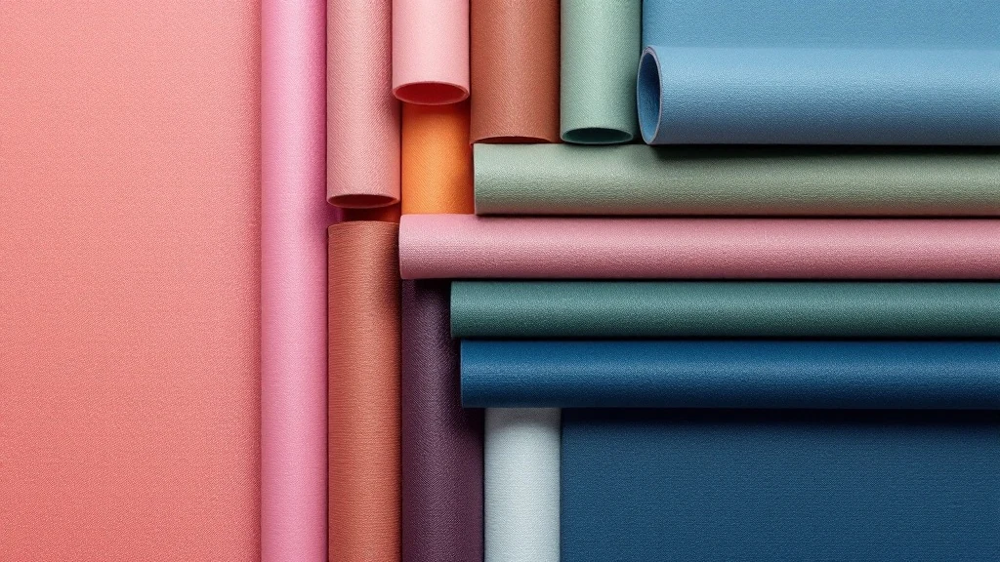

📌 3줄 요약
요가매트는 두꺼울수록 좋은 게 아니라, 소재와 두께를 용도에 맞춰 고르는 물건입니다.

입문·범용은 밀착력 좋은 TPE, 무릎이 많이 닿는 홈트는 쿠션 있는 두께, 밸런스 동작은 얇은 매트가 유리합니다.

요가·밸런스 위주면 4~6mm, 무릎 닿는 홈트·필라테스면 6~8mm를 기준으로 잡으면 실패가 적습니다.

요가매트 사려고 검색하면 "두꺼울수록 좋다"는 말이 많은데, 사실 이게 첫 번째 함정이에요. 결론부터 말하면요, 요가매트는 소재와 두께를 용도에 맞추는 게 핵심이지, 무조건 두껍다고 좋은 게 아닙니다. 저도 처음 찾아봤을 때 소재 이름(TPE·NBR·PVC)이 죄다 알파벳이라 한참 헷갈렸는데, 스펙과 후기를 직접 뒤져 비교해보니 기준이 정리되더라고요. 이 글에서는 요가매트 추천 기준을 소재·두께·사이즈·용도로 나눠, 살 때 실수까지 한 번에 정리해 드릴게요.

## 요가매트, 뭘 먼저 봐야 하나요?

고르기 전에 세 가지만 정하면 선택이 훨씬 쉬워집니다. 소재, 두께, 그리고 사이즈입니다.

**첫째, 소재를 정합니다.** 미끄럼방지, 쿠션감, 냄새, 친환경 여부가 소재에서 갈립니다. 같은 두께라도 소재에 따라 밀착력과 내구성이 크게 달라집니다.

**둘째, 두께를 정합니다.** 여기서 많이들 헷갈리는데, 두꺼울수록 좋은 게 아니라 운동 종류에 맞춰야 합니다. 아래에서 자세히 다루겠습니다.

**셋째, 사이즈를 확인합니다.** 키와 어깨너비, 그리고 집에 두고 쓸지 들고 다닐지에 따라 길이·폭·무게가 달라집니다. 이 세 가지 순서로 보면 후회가 줄어듭니다.

## 소재별 차이 — TPE·NBR·PVC·고무·코르크

소재는 요가매트의 성격을 결정하는 가장 큰 요소입니다. 대표 소재를 정리하면 이렇습니다.

**TPE**는 요즘 가장 무난한 선택입니다. 가볍고 눌러도 잘 복원되며, 소재 자체가 바닥에 잘 밀착돼 미끄럼방지가 좋습니다. 재활용이 되는 친환경 소재라는 점도 장점이죠. 대신 상대적으로 가격이 있고 제품별 내구성 편차가 있습니다. 입문자와 일반 요가에 두루 맞습니다.

**NBR**은 부드럽고 쿠션감이 큰 저렴한 소재입니다. 두께 옵션이 다양해 무릎이 아픈 분들이 찾지만, 밀도가 낮아 오래 쓰면 찢기거나 가루가 나기 쉽고, 바닥 밀착력이 약해 밸런스 동작에서는 밀릴 수 있습니다. 냄새가 나는 제품도 있습니다.

**PVC**는 저렴하면서 내구성과 접지력이 좋고 세척이 쉽습니다. 다만 무겁고 땀이 많으면 미끄러울 수 있으며, 프탈레이트 같은 환경호르몬 이슈로 친환경과는 거리가 있습니다. **천연고무**는 접지력이 가장 뛰어나 파워 요가에 좋지만 무겁고 냄새·라텍스 민감 이슈가 있고, **코르크**는 땀이 날수록 오히려 접지력이 올라가고 항균성이 있어 핫요가나 친환경을 원하는 분께 맞습니다.

## 두께, 두꺼울수록 좋은 게 아닙니다

이게 요가매트에서 가장 많이 하는 실수입니다. 저도 두꺼우면 무조건 편한 줄 알았거든요. 그런데 찾아보니 두께는 운동 종류에 맞춰야 합니다.

얇은 매트일수록 균형을 잡기 좋습니다. 서서 하는 동작이나 밸런스가 중요한 요가라면 4~6mm 안에서도 얇은 쪽이 안정적입니다. 반대로 무릎이나 팔꿈치가 바닥에 자주 닿는 동작, 누워서 하는 코어 운동은 6~8mm 정도로 쿠션이 있어야 관절에 무리가 덜 갑니다.

문제는 무작정 두꺼운 매트입니다. 8mm를 크게 넘어가면 쿠션이 과해져 오히려 무게중심이 흔들리고 발목을 삐끗할 위험이 커집니다. 그래서 요가·밸런스 위주면 4~6mm, 무릎이 많이 닿는 홈트·필라테스면 6~8mm를 기준으로 잡는 걸 추천합니다. 참고로 요가매트는 보통 3~6mm, 필라테스 전용 매트는 8~15mm로 더 두껍습니다. 두 운동을 집에서 다 한다면 5~8mm 범용이 무난합니다.

## 사이즈·무게 — 키와 휴대성에 맞추기

사이즈는 의외로 놓치기 쉬운 부분입니다. 표준 길이는 대략 183cm로, 키 170~180cm 정도면 무난합니다. 키가 크거나 점프·팔 밸런스 동작이 많다면 185cm 이상 긴 매트가 넘어질 위험을 줄여줍니다.

폭은 보통 61~68cm입니다. 어깨가 넓거나 움직임이 큰 편이면 68cm 이상, 넓게는 80cm대 제품이 안정감을 줍니다. 좁은 매트에서 손발이 자꾸 벗어나면 집중이 깨지니, 체형이 크다면 폭도 챙기는 게 좋습니다.

무게도 용도에 따라 봅니다. 스펙을 비교해보니 대체로 1~2kg대는 TPE·PVC로 가벼워 스튜디오 이동이나 여행에 맞고, 2~3kg대는 고무 계열로 무거운 대신 안정적이라 집에 깔아두고 쓰기 좋습니다. 들고 다닐 일이 많으면 가벼운 쪽이 답입니다.

## 용도별 요가매트 추천

지금까지 기준을 용도별로 묶으면 선택이 간단해집니다. 상황에 맞춰 골라보세요.

- **일반 요가·입문** — 밀착력 좋은 TPE, 두께 4~6mm. 가장 무난한 조합입니다.
- **홈트·무릎 닿는 동작** — 쿠션 있는 TPE나 NBR, 두께 6~8mm로 관절 보호.
- **필라테스·코어 운동** — 8mm 이상 두꺼운 매트 또는 필라테스 전용.
- **밸런스·스탠딩 요가** — 4~6mm 중 얇은 쪽으로 균형 우선.
- **핫요가·땀 많은 편** — 땀에 강한 코르크나 고무, PU 코팅 제품.
- **휴대·여행용** — 가벼운 TPE 얇은 매트.

무릎이 특히 걱정된다면 매트 하나로 버티기보다 얇은 매트 위에 무릎 패드를 함께 쓰는 방법도 있습니다. 저도 처음엔 매트만 두꺼우면 다 해결되는 줄 알았는데, 용도별로 나눠 보니 오히려 조합이 답인 경우가 많더라고요. 매트와 함께 갖출 장비가 고민이라면 [홈트 기구 추천](/home-workout-beginner-gear/)과 [조절식 덤벨 추천](/adjustable-dumbbell-guide/) 글도 참고하시면 좋습니다.

## 다이소 vs 브랜드, 뭘 사야 할까

가격대도 고민되죠. 결론부터 말하면, 가볍게 시작할 거면 저가로, 꾸준히 할 거면 중간 이상 브랜드로 가는 게 합리적입니다.

제가 후기를 쭉 훑어보니, 다이소 같은 저가 매트는 부담 없이 시작하기 좋지만 대체로 얇거나 NBR 계열이라 밀림과 가루 문제가 생길 수 있다는 반응이 많았습니다. 몇 번 해보고 운동을 계속할지 가늠하는 용도로는 충분합니다. 반대로 주 3회 이상 꾸준히 할 생각이라면, 처음부터 후기 좋은 TPE 중가 제품을 사는 편이 오래 씁니다. 자주 쓰는 물건은 싼 걸 두 번 사느니 괜찮은 걸 한 번 사는 게 이득일 때가 많으니까요.

제품별 스펙과 실시간 가격은 [다나와 요가매트 카테고리](https://prod.danawa.com/list/?cate=1333304) 같은 가격비교 사이트에서 한 번에 확인할 수 있습니다. 살 때는 소재·두께·사이즈 세 가지를 꼭 같이 보세요.

## 한눈에 정리

바쁘다면 이 표만 봐도 됩니다. 소재별 특징을 압축하면 이렇습니다.

| 소재 | 장점 | 아쉬운 점 | 잘 맞는 경우 |
| --- | --- | --- | --- |
| TPE | 가볍고 밀착력·복원력 좋음, 친환경 | 가격 있고 내구성 편차 | 입문·일반 요가 |
| NBR | 쿠션 크고 저렴, 두께 다양 | 밀림·가루·냄새 | 무릎 닿는 홈트 |
| PVC | 내구성·접지력, 세척 쉬움 | 무겁고 환경호르몬 이슈 | 스튜디오·고빈도 |
| 천연고무 | 접지력 최고, 안정 | 무겁고 냄새·라텍스 | 파워 요가 |
| 코르크 | 땀에 강함, 항균·친환경 | 초기 건조 그립 약함 | 핫요가·에코 |

## 자주 묻는 질문 (FAQ)

**Q. 요가매트 두께는 몇 mm가 좋나요?**
A. 서서 하거나 밸런스가 중요한 요가는 4~6mm, 무릎이 자주 닿는 홈트나 필라테스는 6~8mm가 무난합니다. 8mm를 크게 넘으면 쿠션이 과해 오히려 균형이 흔들릴 수 있으니 주의하세요.

**Q. TPE와 NBR 요가매트 중 뭐가 나은가요?**
A. 밀착력·복원력·친환경은 TPE가 낫고, 저렴하면서 쿠션이 큰 건 NBR입니다. 밸런스 동작이 많으면 밀림이 적은 TPE, 무릎 보호가 우선이면 두꺼운 NBR이 맞습니다.

**Q. 다이소 요가매트 써도 되나요?**
A. 가볍게 시작하는 용도로는 괜찮습니다. 다만 얇거나 NBR 계열이 많아 밀리거나 가루가 날 수 있으니, 꾸준히 할 계획이면 후기 좋은 TPE 중가 제품으로 넘어가는 편이 오래 씁니다.

**Q. 요가매트와 필라테스 매트는 다른가요?**
A. 네. 요가매트는 밸런스와 그립을 위해 보통 3~6mm로 얇고, 필라테스 매트는 바닥·코어 운동의 쿠션을 위해 8~15mm로 두껍습니다. 둘 다 집에서 한다면 5~8mm 범용 매트가 절충안입니다.

---

**관련 키워드** — #요가매트추천 #요가매트두께 #TPE요가매트 #NBR요가매트 #PVC요가매트 #홈트요가매트 #필라테스매트 #요가매트소재 #다이소요가매트 #요가매트고르는법 #홈트레이닝 #코르크요가매트
